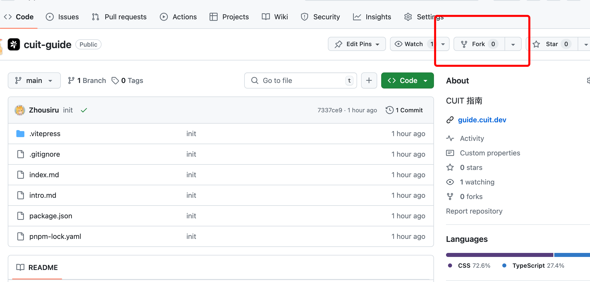
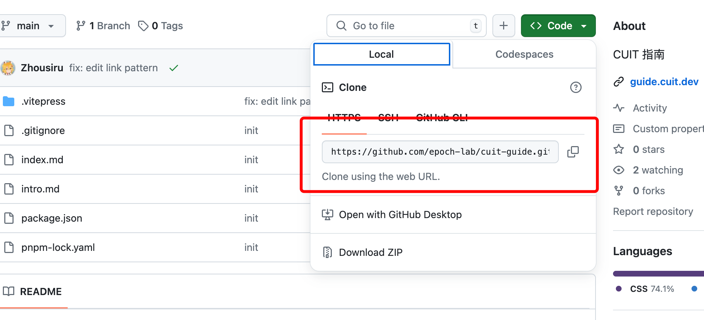
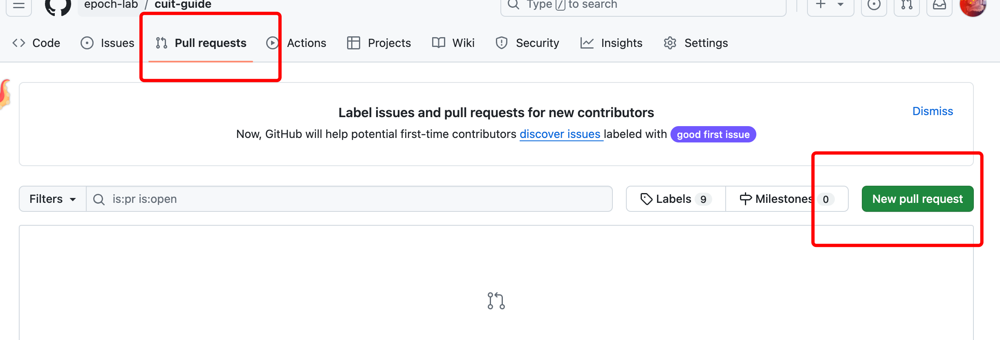
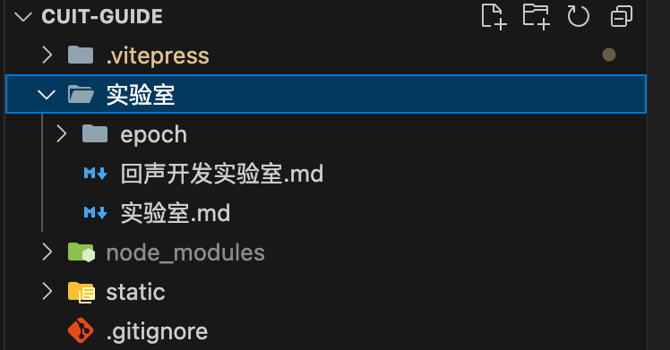
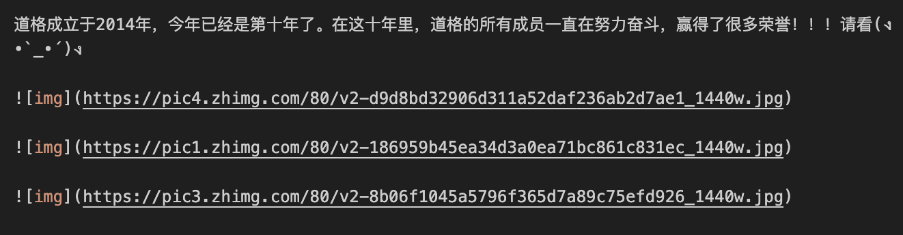
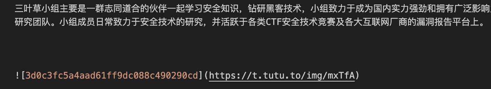
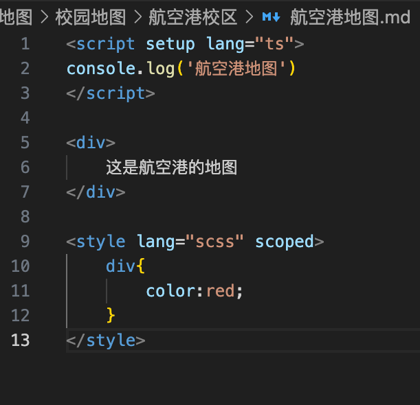

# 这是做什么的?

成都信息工程大学(Chengdu University of InformaTion, 简称CUIT, 或者~~信砖~~,~~驾校~~)指南是一个公益性质的项目的文档项目; 

目的是帮助新入学的CUITer迅速熟悉cuit的方方面面, 从获得上大学后应该有的认知到参与各种具体的组织以及实验室/社团/同好等等, 从学习基本知识到了解成信大的所有; 

# 如何阅读? 移动端请点击左上角菜单 !!!

### 如何参与? 
先fork一下

再将项目拉到本地()
git clone这里的链接: 

直接修改文件夹, 添加markdown即可; 

最后再发起合并请求

如果是略懂前端的小伙伴, 烦请在代码修改之后, 提交之前先build一下, 否则过不了CI/CD哦!

### 如何插入图片?
可以打包成一个文件夹

可以使用知乎/掘金/CSDN等等网站作为图床链接

可以使用免费的图床

### 可以使用vue语法

### 温馨提示: 
记得留下联系方式哦(
    群号/二维码/微信群号/官网/公众号等等...

### 联系我们: 
回声公众群: 834932567