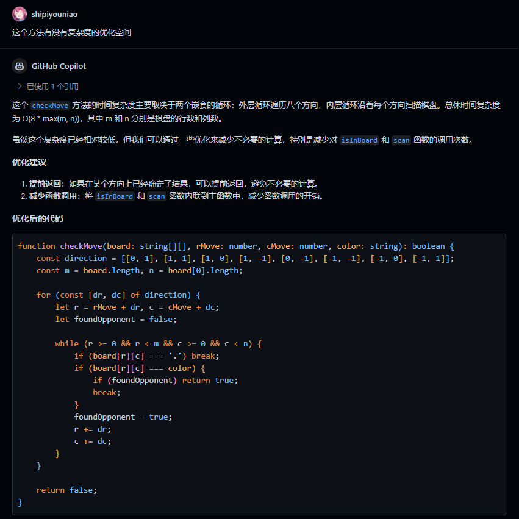
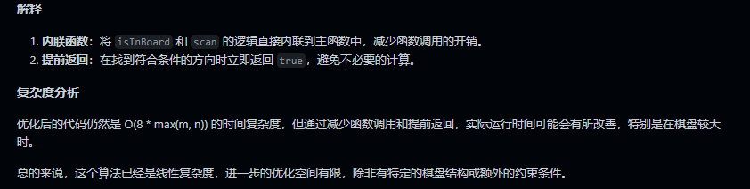

# 如何准备算法

作者：石皮幼鸟 [掘金](https://juejin.cn/user/3437526047270291) | [B 站](https://space.bilibili.com/30915729)

这篇文章是专门为计算机相关专业或想走这一行的同学朋友们准备的，主要是为了帮助你们更好地准备算法，提高你们的算法能力，从而更好地应对秋招春招的挑战。

## 什么叫算法？

粗略地下个定义：**算法是一种解决问题的方法和步骤**

换句话说，你平常做的数学题的解题步骤，你平常完成生活中某一个任务的步骤和方法，都可以看作是一种算法。

在计算机领域，算法往往被抽象成一种可以接受输入，处理输入，然后输出结果的计算机程序，主要目的自然就是解决问题。

具体有哪些问题呢？比如可以简单到给定一个数组，找出数组中的最大值，亦或是可以复杂到给你一群地图上的游戏玩家和任务，写出一个自动寻路的程序。

只要你能想出办法解决上述这种问题，那么你就提出了一个算法。

## 为什么要准备算法

既然这篇文写在了“就业”栏目之下，自然说明了一件事，算法是找工作甚至是在工作中极其重要的一环。

在找工作的过程中，算法题是绕不开的一个环节。无论是笔试（一般只有大厂才有）还是面试，算法题都是必考的一项。

在笔试中，算法题往往是占比最大的一部分。在笔者投的几个大厂实习笔试中，算法编程题基本占卷面的**40% 到 60%**，基本是**2 道题起步**，**一道简单题，一道中等偏困难题**。

在面试中，算法题也是必考的一项。不论是笔试通过后的面试，亦或是中小厂的直接面试，都会有**2 轮起步，5 轮封顶**的技术面试，其中每一轮技术面中算法题都是必考的一项，**少则 1 题，多则 3 题**。

*不过不需要担心，技术面中的算法题难度一般不会太高，一般是 LeetCode 中的简单题和中等题，极少会考察困难题，如果考察了，如果不是压力面的话。大概就是委婉劝退或本身就是 KPI 面。*

在工作中，算法题也是一个重要的环节。在工作中，算法会贯穿你负责的产品的整个业务流程以及生命周期，高效的算法可以提高你的工作效率和工作质量。

*可以说，如果没有算法，你的产品写出来怕是你自己都不会用。*

## 我要准备得多好多深？

这个问题其实没有标准答案，因为每个人的情况不同，准备的深度和广度也会有所不同。

其重点在于，你到底想要投什么样的公司，想要什么样的职位。

先说说公司方面。

如果你想要投大厂，那么你的算法准备就要相对深入，因为大厂的算法题一般会比较难，而且会考察一些高级数据结构和算法，比如大厂（特别是字节）很喜欢在面试的时候问你 B+ 树、红黑树、最短路径算法、最小生成树算法、前缀和等一系列问题。

如果是中小厂，那么算法题的难度就会相对简单一些，一般就是 LeetCode 中的简单题和中等题。不要太有心理压力，只要准备了肯定就能过。

再聊聊岗位方面。

如果你想要投**研发岗位**（做一些业务逻辑的开发），那么实际上**你不太需要精进算法**，因为实际的复杂业务算法往往是算法岗同学提供的，而简单一些的业务逻辑算法你自己也能写出来。你只需要保证自己的**业务代码写的不烂，多写注释，命名规范一些，少写点语法糖，给代码优化留出空间**就行。

然而，如果你想要投**算法岗**，那么你的**算法准备就要相对深入**，甚至需要你去准备一些**算法竞赛的相关经验**，比如 ACM、OI 等。然而我必须警告你，算法岗是一个**对数学系友好**的岗位，这意味着在校招中会多出来一批数学系的同学与你竞争。

至于其他的岗位，比如**测试、运维、产品、设计**等，**算法题的考察会相对较少，甚至不会考察**。但是，如果你能在这些岗位中有一定的算法基础，那么你的工作效率和工作质量会有所提高。

如果你一定要走算法岗，我非常建议你直接冲进校内 ACM 实验室里，埋头苦练三年，否则在信息差的影响下，你的算法基础很难达到大厂的要求。此外，我还是比较建议你花时间研究下业务开发方面的内容，不要只专注算法，因为算法岗的工作往往是在业务开发的基础上进行的，甚至你可能会需要去优化研发岗同学写的业务代码。

如果你不走算法岗，笔者认为算法实验室并不太适合你。有些人可能会说，进算法实验室苦练几年，以后笔试面试不愁算法题。但我必须提醒你，在秋招前三年这有限的时间之内，如果你只顾着算法不练开发，八股也没背过，没有什么项目经验，***你的简历会显得很空洞，你的面试官会觉得你是一个只会写算法题的人，而不是一个全面发展的人***。

**总结一句：千万不要捡了芝麻丢了西瓜。**

## 怎么准备算法

### 1. 选择合适的编程语言

你一定要看准你投的是什么岗位，尽可能选择对应的语言练习，否则，如果在面试中选择了岗位不对应的语言，那么你的面试官会觉得你不够专业，印象分会大打折扣。

***你甚至不能用岗位对应的语言写算法题，你怎么能胜任这个岗位呢？***

简单举个例子，如果你想要投前端岗位，那么你就要选择JavaScript、TypeScript等前端常用语言来练习算法题，而不是选择Go、Java等后端语言。如果你要投Unity3D的游戏岗位，那么你就要选择C#来练习算法题，而不是选择C++，否则面试官会怀疑你是不是虚幻岗没投过，转投我们的Unity岗（笔者群友亲身经历）。

在岗位相符的情况下，如果有多种语言可供选择，那么最先应该考虑自己所熟悉的语言，因为你熟悉的语言会让你在面试中更加得心应手，不至于在面试中因为语言问题而出现失误。

其次，你可以选择一些相对动态的、弱类型的脚本语言，因为这种语言的语法相对简单灵活，提供了很多方便处理数据的 API，非常适合写算法题，比如笔者的力扣提交几乎全用的 TypeScript（本质是 JavaScript 的超集）。***比如说，JS 的数组也是栈和队列的实现，写起来实在很方便。但需要注意，JS 不像其他语言一样实现了优先队列这种数据结构，可能需要你自己实现。***

### 2. 选择合适的算法题库

这里首推 LeetCode，因为 LeetCode 是一个非常全面的算法题库，支持市面上大部分常用的语言，涵盖了几乎所有的算法题型，而且题目的难度也区分了简单、中等和困难几个档位，非常适合新手入门。实际上部分题目的难度有点诈称和逆诈称，比如有些简单题比困难题还难，有些困难水题我看两眼就秒了。

[点我进入 LeetCode（中国站）](https://leetcode-cn.com/)

[点我进入 LeetCode（国际站）](https://leetcode.com/)

当然，除了 LeetCode 之外，还有一些其他的算法题库，比如牛客网、Codeforces、AtCoder 等，你可以根据自己的喜好选择。

### 3. 制定合理的学习计划

在准备算法的过程中，你一定要制定一个合理的学习计划，这样才能让你的学习更加有条理，更加高效。

仅针对面试而言，笔者建议你在大二开始就可以考虑准备算法了，因为算法是一个需要长时间积累的东西，不可能在短时间内就能学会，而且你在秋招面试前还需要准备实习，投实习也是需要面试的，自然离不开算法题。

在制定学习计划的时候，你可以参考一些大佬的学习计划，比如[labuladong 的算法小抄（GitHub 站点）](https://labuladong.github.io/algo/) / [labuladong 的算法小抄（Gitee 站点）](https://labuladong.gitee.io/algo/)，这是一个非常全面的算法学习资料，涵盖了大部分的算法题型，而且讲解非常详细，非常适合新手入门。

在准备算法前，不建议开始刷经典题库或者做每日一题，因为你根本没有算法基础，即便开始做简单题也肯定是一头雾水。笔者建议你先学习一些基础的数据结构和算法，比如数组、链表、栈、队列、树、图、排序、查找等，然后再开始刷题，比如这个视频就挺不错：

[【强烈推荐】深入浅出数据结构 - 顶尖程序员图文讲解 - UP 主翻译校对 (已完结)](https://www.bilibili.com/video/BV1Fv4y1f7T1)

接下来，你应该巩固基础知识，笔者建议你先刷剑指 offer 题库，因为剑指 offer 题库涵盖了大部分的基础算法题，而且题目的难度偏易，非常适合新手入门。

[点我进入剑指 offer 题库（牛客网，要花钱）](https://www.nowcoder.com/ta/coding-interviews)

[点我进入剑指 offer 题库（GitHub 站点 Wiki 备份，免费）](https://doocs.github.io/leetcode/lcof/3/)

你可以每天固定刷一道力扣的每日一题，如果每日一题难度比较高，可以参考一下题解，然后自己再写一遍，这样可以提高你的编程能力和算法能力。

在秋招前三个月，我建议开始集中刷力扣学习计划题库。

笔者这里推荐[面试经典 150 题](https://leetcode.cn/studyplan/top-interview-150/)，基本涵盖了大部分的面试算法题，而且题目的难度也比较适中，非常适合秋招前的准备。

此外，如果有时间，你还可以刷一些高频题，比如[力扣热题 100](https://leetcode.cn/studyplan/top-100-liked/)、[LeetCode 75](https://leetcode.cn/studyplan/leetcode-75/)，这些题目是面试中经常考察的题目，刷一遍可以提高你的面试通过率。

大概刷到**200 道题**左右，你的算法基础就差不多了，可以开始准备面试了。

### 4. 刷题技巧

在刷题的过程中，你一定要注意一些技巧，这样才能让你的刷题更加高效。

首先，你一定要注意**题目的难度**，不要一开始就刷中等题甚至困难题，因为困难题往往需要一些高级的数据结构和算法，而且题目的难度也比较大，容易让你产生挫败感。

其次，你一定要注意**题目的类型**，不要一味地刷一种类型的题目，因为面试中的算法题是多样的，你需要掌握各种类型的题目，这样才能更好地应对面试。

再次，你一定要注意**题目的解法**，不要一开始就看题解，因为这样会让你失去思考的机会，你应该先自己思考一下，然后再看题解，这样可以提高你的思考能力。此外，如果时间充裕，尽可能多地尝试一些不同的解法，这样可以提高你的编程能力。写出不同的解法后，可以在提交记录编辑一下注释，标注你用了什么解法，方便后续对比和复习。

最后，**善用 AI**。笔者常常在写完算法题之后，将代码复制到 IDE 中，询问 GitHub Copilot 等 AI 助手“我这段算法有没有复杂度上的优化空间？”、“我的代码规范吗，有没有可以优化的地方？”等等问题，辩证地看待 AI 写的代码，好的就采纳，坏的就当他没说，这样可以提高你的编程能力和代码质量。甚至有些时候 AI 的解法比官解还要好，经常能耗时和内存占用一起击败 100% 的其他用户提交。

## 总结

别看整篇文章写得这么长，其实重点的内容也就那么几句话：

* 算法是找工作甚至是在工作中极其重要的一环。
* 算法题是绕不开的一个环节，无论是笔试还是面试。
* 算法题的难度取决于你投的公司和岗位。
* 选择合适的编程语言、算法题库、制定合理的学习计划、刷题技巧，这些都是你准备算法的关键。

最重要的是要记住这句话：

**千万不要捡了芝麻丢了西瓜。**

最后祝各位同学朋友们都能在秋招春招中取得好成绩，找到自己满意的工作，加油！

