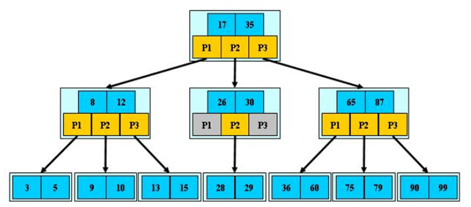
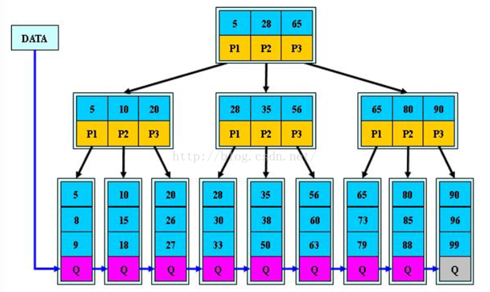

**本模块是公共类课程，适合绝大部分计算机岗位。**

## 什么是搜索树和平衡树？

搜索树（Search Tree）是一种由二叉树、多路树或其他形式形成的树形结构，用于快速查找、插入和删除数据。

二叉搜索树就是一种搜索树，它具有以下特点：

1. 左子树上所有节点的值均小于它的根节点的值。
2. 右子树上所有节点的值均大于它的根节点的值。
3. 以此类推，左右子树也分别为二叉搜索树。

如图所示，左子树上所有节点的值均小于根节点的值，右子树上所有节点的值均大于根节点的值，因此是一棵二叉搜索树。

```markdown
    5
   / \
  3   7
 / \ / \
2  4 6  8
```

一般情况下，二叉搜索树的查找、插入和删除操作的时间复杂度均为 O(logN)，其中 N 为节点的数量，但在极端情况下，二叉搜索树可能退化为链表，时间复杂度为 O(N)。

为了解决二叉搜索树的退化问题，提高检索效率，出现了平衡树（Balanced Tree）。

平衡树是一种特殊的搜索树，通过某种机制保持树的平衡，确保操作的时间复杂度在最坏情况下也能保持较低。

常见的自平衡树包括：

1. AVL 树：AVL 树是一种高度平衡的二叉搜索树，每个节点的左右子树高度差不超过 1，查询效率高，但是插入和删除效率低。
2. 红黑树：红黑树是一种近似平衡的二叉搜索树，每个节点是红色或黑色，查询、插入和删除效率都比较稳定。
3. B 树：B 树是一种多路搜索树，每个节点可以有多个子节点，可以减少树的高度，提高检索效率。
4. B+ 树：B+ 树是一种多路平衡搜索树，每个节点可以有多个子节点，叶子节点之间有指针相连，适合磁盘存储。

平衡树的设计目的是为了提高检索效率，确保操作的时间复杂度在最坏情况下也能保持较低。

## 讲讲 AVL 平衡二叉树的特点和实现

AVL 树是一种高度平衡的二叉搜索（排序）树，每个节点的左右子树高度差不超过 1，增删改查的时间复杂度均为 O(logN)，主要特点如下：

1. **高度平衡**：每个节点的左右子树高度差不超过 1，可以保持树的平衡，提高检索效率。
2. **自平衡**：在插入和删除节点时，AVL 树会自动进行旋转操作以保持树的平衡。

AVL 树的实现主要有以下几个步骤：

1. **右旋转（LL 旋转）**：当左子树的高度比右子树的高度高 2 时，进行右旋转，保持树的平衡。
   
    ```markdown
    LL 旋转图示：

      旋转前              旋转后
        30                 20
       /                  /  \
      20        ->      10    30
     /
    10
    ```
  
2. **左旋转（RR 旋转）**：当右子树的高度比左子树的高度高 2 时，进行左旋转，保持树的平衡。
   
    ```markdown
    RR 旋转图示：

      30                 40
       \                /  \
        40     ->     30    50
         \
          50
    ```
3. **左右旋转（LR 旋转）**：当左子树的右子树的高度比左子树的左子树的高度高 1 时，先左旋转，再右旋转，保持树的平衡。
  
    ```markdown
    LR 旋转图示：

        30                 30                 20
       /                  /                  /  \
      10        ->      20        ->       10    30
       \                /
       20             10
    ```

4. **右左旋转（RL 旋转）**：当右子树的左子树的高度比右子树的右子树的高度高 1 时，先右旋转，再左旋转，保持树的平衡。

    ```markdown
    LR 旋转图示：

      30                 30                   40
       \                  \                  /  \
        50       ->       40        ->     30    50
       /                   \
      40                   50
    ```

AVL 树的实现主要是为了保持树的平衡，提高检索效率，根据不同的需求选择合适的实现方式，以确保树的高度平衡。

## 讲讲红黑树的特点

红黑树（Red-Black Tree）是一种特化的 AVL 树，每个节点是红色或黑色，增删改查的时间复杂度均为 O(logN)，主要特点如下：

1. **节点颜色**：每个节点是红色或黑色，根节点是黑色，叶子节点是黑色（NIL 节点）的空节点。
2. **路径规则**：从任一节点到其每个叶子节点的所有路径都包含相同数量的黑色节点。
3. **红色节点**：红色节点的两个子节点必须是黑色，不能有两个相邻的红色节点。
4. **平衡性**：红黑树通过颜色和旋转操作来保持平衡，插入和删除操作的时间复杂度为 O(log N)。

如果我们把当前节点称作 cur，父节点称作 p，祖父节点称作 g，叔叔节点称作 u，那么红黑树的实现主要有以下几个步骤：

## 红黑树的插入操作

1. **插入节点**：将新节点插入到红黑树中，初始颜色为红色。
2. **修复树**：通过旋转和重新着色来修复红黑树的性质，确保树的平衡。旋转操作与 AVL 树一致。

### 插入修复步骤

1. **情况 1**：新节点是根节点，直接将其颜色改为黑色。
2. **情况 2**：新节点的父节点是黑色，不需要修复。
3. **情况 3**：新节点的父节点是红色，需要进行修复操作：
    - **情况 3.1**：叔叔节点是红色，该过程不需要旋转。将父节点和叔叔节点改为黑色，祖父节点改为红色，然后将当前节点指向祖父节点，继续递归修复直到完成。
   
    ```markdown
    情况 3.1 图示：

            g(B)                    g(R)                 cur(R)
            / \                     / \                   / \
         p(R)   u(R)      ->     p(B)  u(B)     ->     p(B)  u(B)
         /                       /                     /  
      cur(R)                   cur(R)              old_cur(R)
    ```
   
    - **情况 3.2**：叔叔节点不存在或是黑色且当前节点为左节点，需要单旋转操作。一般这种情况都是情况 3.1 递归后得到的。
   
    ```markdown
    情况 3.2 图示：

            g(B)                   p(R)                             p(B)                                cur(R)
            /  \       g右旋       /  \       p变黑，g变红           /  \          cur指向p               /  \
         p(R)   u(B)    ->     cur(R)  g(B)        ->           cur(R)  g(R)        ->          old_cur(R)  g(R)
         /                              \                                 \                                   \
      cur(R)                             u(B)                             u(B)                                u(B)
    ```

    - **情况 3.3**：叔叔节点不存在或是黑色且当前节点为右节点，需要双旋转操作。一般这种情况都是情况 3.1 递归后得到的。
   
    ```markdown
    情况 3.3 图示：

            g(B)                   cur(R)                            cur(B)
            /  \      p左右旋       /  \      cur变黑，g变红           /  \
         p(R)   u(B)    ->       p(R)  g(B)        ->              p(R)  g(R)
            \                            \                                 \
           cur(R)                        u(B)                              u(B)
    ```

## 红黑树的删除操作

1. **删除节点**：将要删除的节点标记为删除，然后进行删除操作。
2. **修复树**：通过旋转和重新着色来修复红黑树的性质，确保树的平衡。

红黑树删除操作极其复杂，且考研和求职面试基本不会考察，因此这里不做详细介绍。

## 讲讲 B 树的结构和特点

B 树是一种多路搜索树，主要用于数据库和文件系统中，具有以下特点：

1. **关键字集合分布在整棵树中**：任何一个关键字出现且只出现在一个节点中。
2. **搜索可能在非叶子节点结束**：搜索过程中可能在非叶子节点找到目标关键字。
3. **搜索性能等价于在关键字全集内做一次二分查找**：B 树的高度较低，搜索效率高。
4. **自动层次控制，自动平衡**：B 树通过插入和删除操作自动保持平衡，确保树的高度较低。

B 树的结构主要有根节点、内部节点和叶子节点，每个节点可以有多个子节点，可以减少树的高度，提高检索效率。

一个 m 阶（m > 3）的非空 B 树满足以下几个条件：

1. **节点的子节点数量**：除了根节点和叶子节点外，每个节点至少有 `m/2` 个子节点，最多有 m 个子节点。
2. **节点的关键字数量**：每个节点由两部分组成，一部分是指向子节点的指针，一部分是关键字。每个节点包含的关键字数量为 n，且满足 `m/2 - 1 ≤ n ≤ m - 1`，指针的个数是 `n+1`。
3. **根节点的子节点数量**：根节点至少有两个子树，除非整棵树只有根节点。
4. **叶子节点的层次**：所有叶子节点都在同一层，叶子节点的指针为空。
  


## B 树的插入操作（删除一般不考）

1. **找到插入位置**：从根节点开始，找到适当的叶子节点插入关键字。
2. **插入关键字**：将关键字直接插入在节点的左侧或右侧。
3. **节点分裂**：如果插入后节点的关键字数量超过 `m - 1`，则进行节点分裂，将一半的关键字元素连带对应指针分裂到其相邻的新节点，中间关键字元素上升到父节点，如果根节点分裂，则创建一个新的根节点。

## 讲讲 B+ 树的结构和特点
  
B+ 树是一种多路平衡搜索树，是 B 树的一种变种，主要特点如下：

1. **多路平衡搜索树**：每个节点可以有多个子节点，可以减少树的高度，提高检索效率。
2. **平衡树**：每个节点的子节点数目相同，可以保持树的平衡，提高检索效率。
3. **自平衡树**：可以自动调整树的结构，保持树的平衡，提高检索效率。
4. **叶子节点有序**：B+ 树的叶子节点是有序的，可以加快区间查询的速度。
5. **非叶子节点不存储数据**：B+ 树的非叶子节点只存储索引，不存储数据，可以减少 IO 操作，提高检索效率。

B+ 树的结构主要有根节点、内部节点和叶子节点，每个节点可以有多个子节点，可以减少树的高度，提高检索效率。

换句话说，和 B 树的区别在于：
  
1. **非叶子节点的子树指针数和关键字数相同**：B+ 树的非叶子节点的子树指针数等于关键字数，而 B 树的非叶子节点的子树指针数总是比关键字数多 1。
2. **非叶子节点孩子范围是左闭右开**：B+ 树的非叶子节点的孩子范围是左闭右开区间。
3. **所有叶子节点有链指针**：B+ 树的所有叶子节点通过链指针连接，便于区间查找。
4. **所有关键字都在叶子节点上**：B+ 树的所有关键字都存储在叶子节点上，非叶子节点只存储索引。
5. **搜索只会在叶子节点上结束**：B+ 树的搜索操作最终会在叶子节点上结束。



B+ 树一般不考插入删除。

## 讲讲字典树的结构和特点

字典树（Trie 树）是一种树形结构，用于存储字符串，主要特点如下：

1. **树形结构**：字典树是一种树形结构，每个节点有多个子节点，可以存储字符串，提高检索效率。
2. **前缀树**：字典树是一种前缀树，每个节点代表一个字符，可以存储前缀，提高检索效率。
3. **多叉树**：字典树是一种多叉树，每个节点可以有多个子节点，可以存储多个字符，提高检索效率。
4. **非平衡树**：字典树并不是一种自平衡树，它不需要自动调整树的结构来保持平衡。

字典树的结构主要有根节点、内部节点和叶子节点，每个节点可以有多个子节点，可以存储字符串，提高检索效率。

### 字典树的实现步骤

1. **插入字符串**：将字符串的每个字符插入到字典树中，直到字符串的最后一个字符。每个字符对应一个节点，如果节点不存在则创建新节点。
2. **查询字符串**：从根节点开始查找字符串的每个字符，直到字符串的最后一个字符。如果所有字符都能找到，则字符串存在于字典树中。
3. **删除字符串**：从根节点开始删除字符串的每个字符，直到字符串的最后一个字符。如果某个节点没有其他子节点且不是其他字符串的前缀，则可以删除该节点。

### 字典树的优缺点

**优点**：
1. **快速检索**：可以在 O(m) 时间复杂度内完成字符串的插入、删除和查询操作，其中 m 是字符串的长度。
2. **前缀匹配**：非常适合用于前缀匹配和自动补全功能。

**缺点**：
1. **空间复杂度高**：对于字符集较大的语言（如中文），字典树的空间复杂度较高，因为每个节点可能有多个子节点。
2. **不适合存储大量短字符串**：如果存储大量短字符串，字典树的空间利用率较低。

### 注意事项

字典树适用于字符集较小的语言（如英文），因为英文只有 26 个字母。而对于字符集较大的语言（如中文），字典树的空间复杂度较高，需要根据具体需求选择合适的数据结构。