# 如何在IDEA手动配置Tomcat以及导入导出带Java源码的war包

<span style="color: gray">作者：石皮幼鸟 [掘金](https://juejin.cn/user/3437526047270291) | [B站](https://space.bilibili.com/30915729)</span>

## 前言，以及什么是Tomcat和War包

如果你的课表中恰好有一门课程名为“Web应用程序设计”，那么你就来对地方了。

更巧的是，如果你是软工的学生，那么你的老师也会发一篇和本文一模一样的Word文档，其实那篇文档就是笔者写的这篇文章。

在这门课程中，学校会教一门极其落伍的技术——JSP，这是一种在服务器端生成动态网页的技术，但是这种技术已经被淘汰了，现在的前端开发都是用React、Vue、Angular等框架，后端开发都是用SpringBoot、Express、Django等框架，即便是前后端不分离架构，也是用Thymeleaf、Freemarker等模板引擎。

但很明显，这门课教的JSP技术并没有这么先进，所以你需要手动配置Tomcat，然后将你的项目打包成一个war包，然后部署到Tomcat上。

那么，什么是Tomcat，什么是War包呢？

Tomcat是一个开源的Servlet容器，是一个JSP/Servlet容器，是Apache软件基金会（Apache Software Foundation）的Jakarta项目中的一个核心项目，由Apache、Sun和其他一些公司及个人共同开发维护。

简单来讲，Tomcat是一个服务器，它能够运行JSP和Servlet，是一个Java的Web服务器。

War包是一种Web应用程序的打包格式，它是一种压缩文件，其中包含了Web应用程序的所有内容，包括HTML、JSP、Servlet、Java类、XML、EJB、TLD、JAR、WAR文件等。和你常常接触的Jar包类似，但是War包是专门用来部署Web应用程序的。在War包被打包好之后，你可以将War包部署到Tomcat上，然后Tomcat就会解压War包，然后运行你的Web应用程序。

当然，如果你接触过SpringBoot，你可能会发出疑问，SpringBoot项目也是Java的Web项目，为什么打包出来是Jar包而不是War包呢？

这是因为SpringBoot实际上对大量技术进行了封装，比如，原本需要写大量xml配置文件的Spring，现在只需要一个注解就能完成，设置包括原本需要配置的Tomcat也在内部封装好了，所以SpringBoot项目打包出来是Jar包，而不是War包。

在这门课当中，老师会要求你手动配置Tomcat，导入老师发给你的包含Java源码的War包，然后修改Java源码，重新打包包含源码的War包，然后再次部署到Tomcat上。

由于大家现在常用的开发工具是IDEA、VSCode等，配置Tomcat以及导入导出War包与Eclipse的差距实在过大，特别是导入War包的功能在当前已不流行，故IDEA是完全不支持的。

绝大部分同学都会选择直接导入Eclipse，但是Eclipse实在太丑太难用了，所以我写了这篇文章，帮助大家在IDEA中手动配置Tomcat，导入导出War包。

## 如何导入包含源码的War包，并配置Tomcat

IDEA不能直接导入war包，比较麻烦，想要导入war包只能手动操作。

首先，将下载好的war包后缀名改为rar，备用。


接下来在idea中新建一个web应用项目，我们在生成器栏里选择Jakarta EE（旧版本是Java Enterprise），模板设置为Web应用程序，应用程序服务器设置为Tomcat，如果没有，点击右边的新建按钮，选择我们解压好的Tomcat文件夹即可。

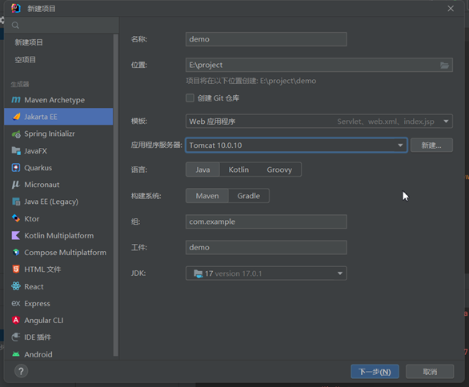

单击下一步，确认在规范目录下已经勾选好Servlet，单击创建。

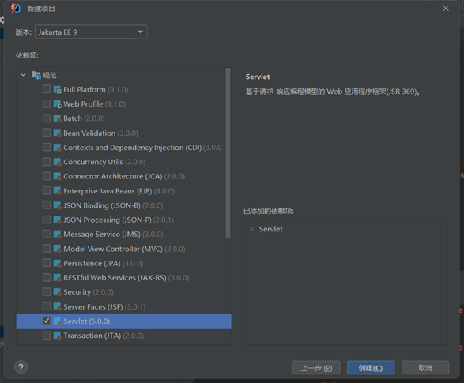

这是项目的基础目录结构。

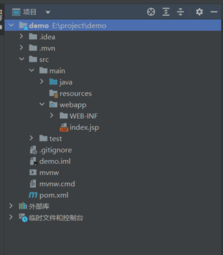

删除webapp文件夹下的所有内容，然后把rar里所有文件丢到webapp下。

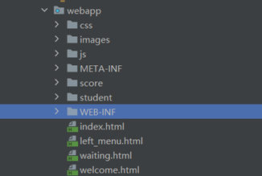

接下来处理WEB-INF文件夹的内容。删除`/src/main/java`文件夹下的内容，把classes文件夹里的.java文件移到`/src/main/java`里面。（注意，没有特殊要求不要把class文件丢进去，你可以放进去之后手动删掉class文件）

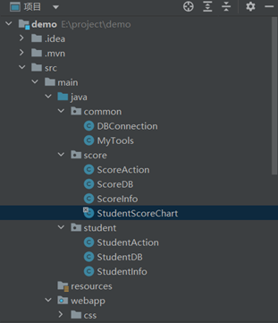

接下来右击项目名称，点击打开模块设置。当然，你也可以通过 文件-项目结构-项目设置-模块 找到接下来的操作界面。

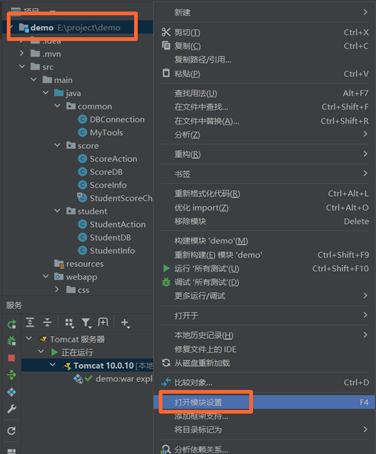

点击“依赖”，选择“JAR或目录…”，然后选中项目内WEB-INF文件夹里面的lib文件夹，添加后点击确定即可。

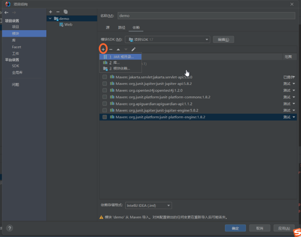
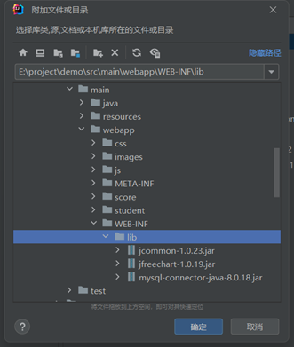
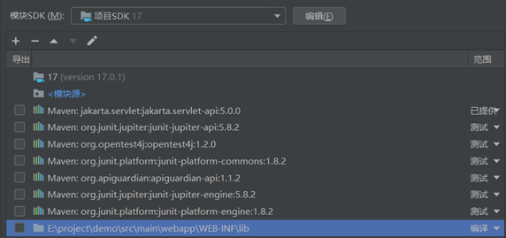

现在我们来配置运行web项目。右上角运行按钮旁边应该会出现一个Tomcat服务器的运行配置。

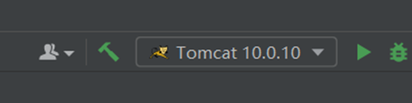

不管有没有，点开下拉栏，点击编辑配置。

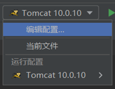

如果没有，就点击左上角“+”添加新配置，点击Tomcat服务器-本地。

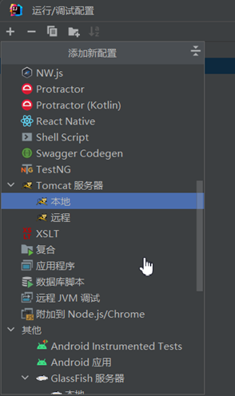

右侧栏目中，在“应用程序服务器”这一行点击配置，选择Tomcat解压的文件夹即可。

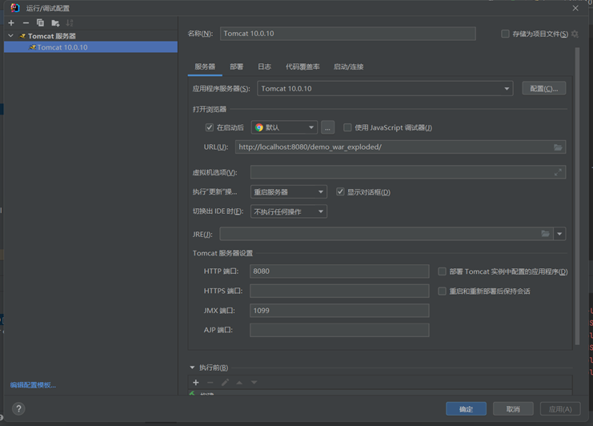

然后单击“部署”，在“在服务器启动时部署”栏中应该会出现一个已经配置好的工件。

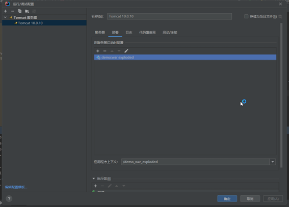

如果没有，点击“+”然后选择工件即可。如果没有工件选项，需要去项目结构自行配置，这说明前面的流程你没有跟着我的教程走，idea没有识别到你的web.xml。

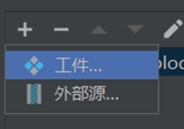

现在点击运行，网页应该就可以正常跑起来了。

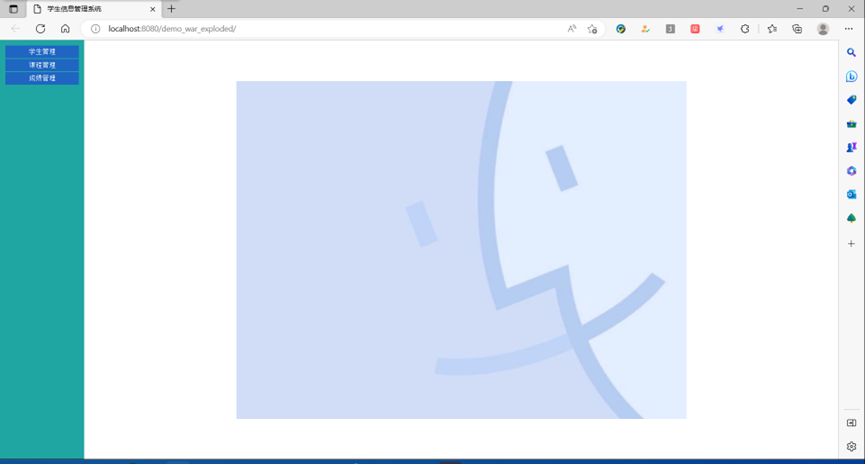

## 如何导出包含源码的War包

由于我们创建的是Maven项目，而Maven已经为我们提供了轻松导出war包的指令，所以导出war包并非难事。创建项目后IDEA应该会自动帮我们配置Maven，如果没有或者配置不了，可以参考这个视频：[教程](https://www.bilibili.com/video/BV16Q4y127BZ/)

在Maven项目中，pom.xml（Project Object Model）对于项目的配置起着主导控制作用，我们有空可以百度自学简单了解Maven项目中pom.xml的结构与功能。

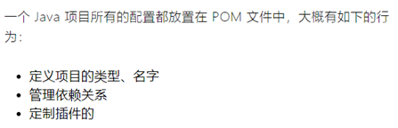

我们打开项目的pom.xml，重点看到packaging标签。这个标签管理maven项目的导出格式，有jar、war、ear和pom四种。大部分项目默认是jar，这意味着项目会导出成jar包，我们把里面的值改成war，像图中这样即可。

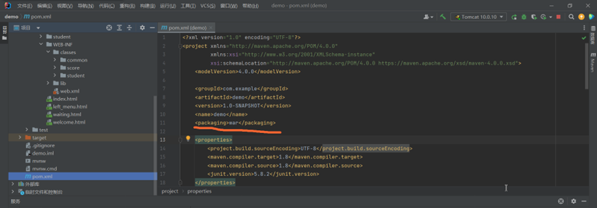

接下来我们打开idea的终端，或者在cmd中使用cd指令跳转到项目目录，输入指令：
    
```shell   
mvn clean package
```

（这条指令是clean和package的组合，clean用于清除target生成的内容，package用于生成内容）

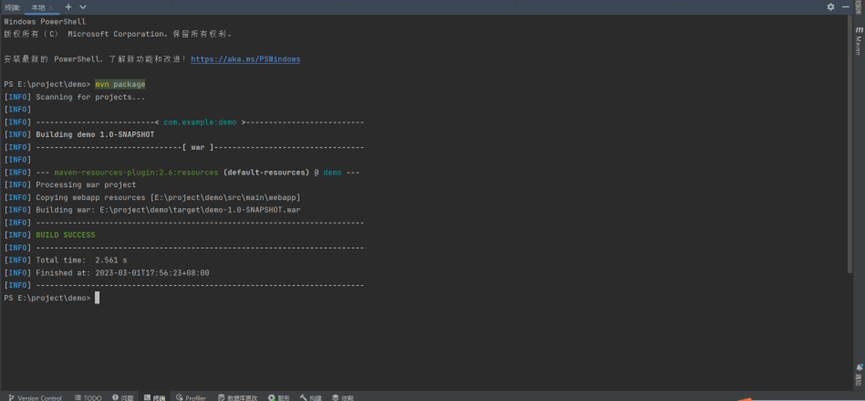

等待片刻，接下来我们可以看到在项目根目录/target文件夹下出现了打包好的war文件。

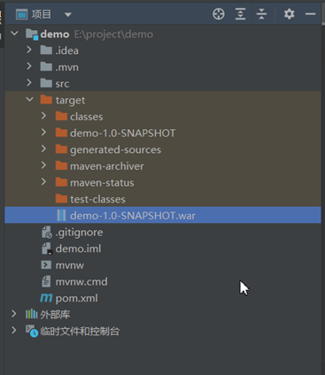

这个时候我们会发现，导出的war包里面不包含我们在`src/main/java`文件夹下的java文件，只包含生成好的class文件，这是为什么呢？

这是因为，默认情况下，maven只把我们的resources文件夹和webapp文件夹当成了资源文件夹处理。我们继续处理pom.xml。

在pom结尾会出现build标签。

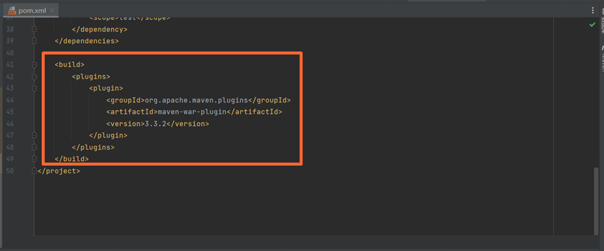

在`<build>`标签中加入如下内容：（包括springboot项目也可以这样做）

```xml
<resources>
    <resource>
        <directory>src/main/java</directory>
        <includes>
            <include>**/*.java</include>
            <!-- 你如果有其他后缀的文件也可以往里放，比如kotlin脚本 -->
            <!-- <include>**/*.kt</include> -->
        </includes>
    </resource>
</resources>
```

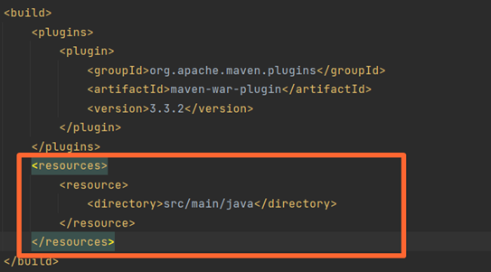

现在我们重新执行`mvn clean package`指令。执行完后我们会发现，在生成的war包的`/WEB_INF/classes`里面有我们需要的java代码了。（这里我拿我自己写的spring项目生成的文件演示）

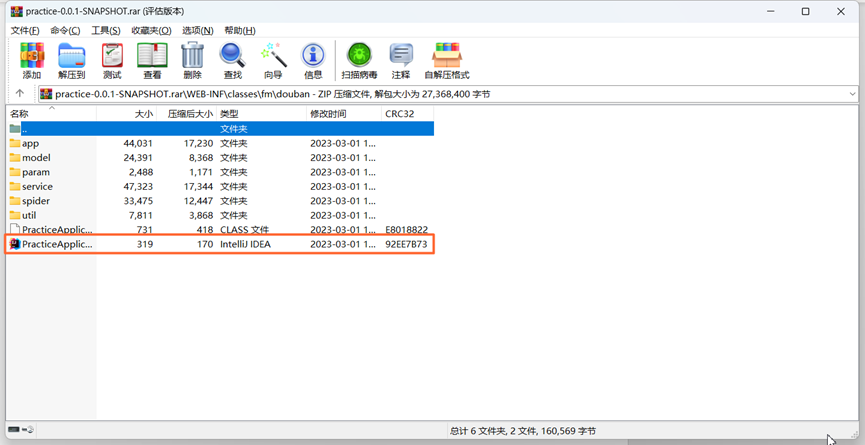

这样我们就成功导出了包含源码的war包。