# CUIT-ACM 简介

## 1. 什么是 ACM

**国际大学生程序设计竞赛**（英语：International Collegiate Programming Contest，缩写：ICPC），也称 ACM 竞赛，是一项旨在展示大学生创新能力、团队精神和在压力下编写程序、分析和解决问题能力的年度竞赛。经过 50 多年的发展，国际大学生程序设计竞赛已经发展成为最具影响力的大学生计算机竞赛。

ICPC 以团队的形式代表各学校参赛，每队由 3 名队员组成。比赛期间，每队使用 1 台电脑需要在 5 个小时内使用 Java、C、C++、Kotlin 或 Python 中的一种编写程序解决 8 到 13 个问题。比赛中的问题大多数都较为困难，包含了许多需要使用算法解决的具有挑战性的综合问题。因此竞赛中的很多试题都需要选手当场作出分析，而不是套用固定的解题格式，这是竞赛的困难所在，也是它的魅力所在。

## 2. 什么是 CUIT-ACM 实验室？

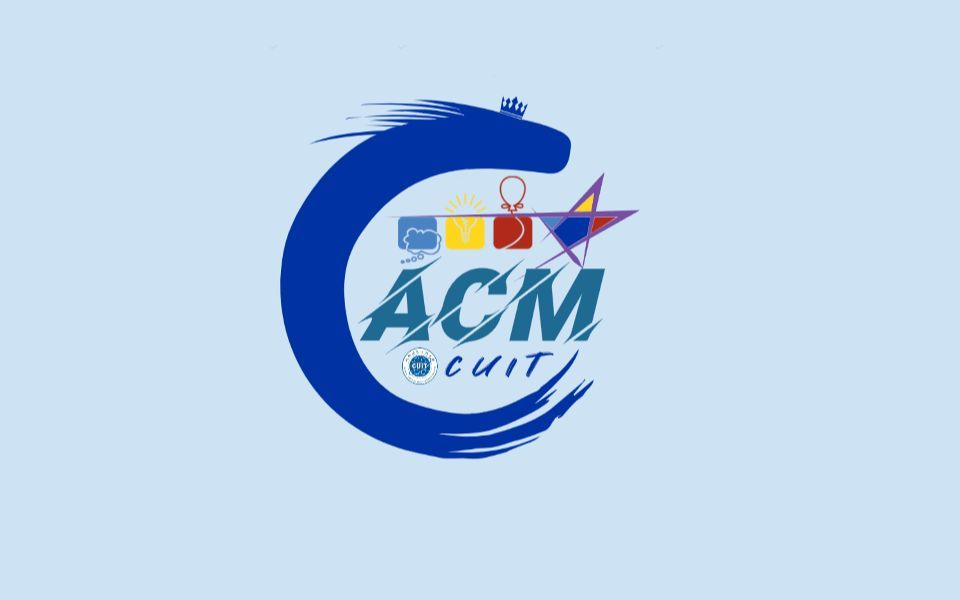

ACM 实验室，依托程序设计竞赛，旨在培养大学生创新能力、团队精神和在压力下编写程序、分析和解决问题的能力。

通过指导、讲座、交流和比赛，队员们的编程能力、英语水平、自主学习能力、创新能力、团队协作以及与人交流的能力都有了大幅度的提高，同时，面对生活、面对成败也有了更积极的态度。

CUIT-ACM 实验室创办以来，每年代表院系参 ACM 大学生程序设计竞赛，以及协助院系组织参加“蓝桥杯”全国软件和信息技术专业人才大赛、中国高校计算机大赛——团体程序设计天梯赛、中国大学生计算机设计大赛等专业类的比赛。

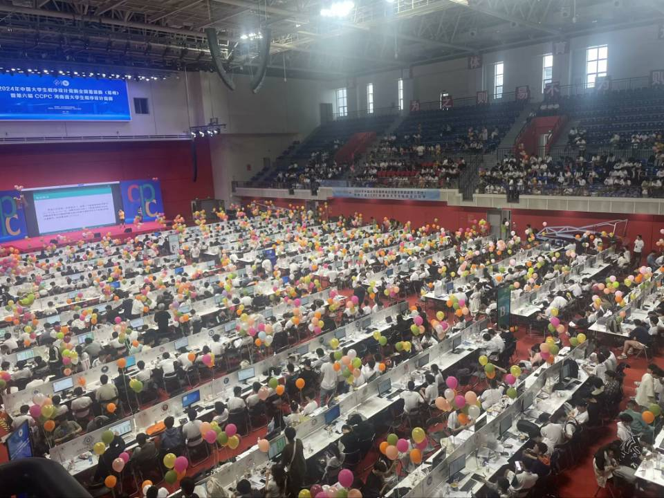

## 3. 加入 ACM 实验室能获得什么？

> 打 ACM 的人，都知道：学习算法，参加竞赛，得奖，加分，拿奖学金，进大厂。

**1. 固定的实验场地**

ACM 实验室现位于成都信息工程大学双中心 B 座 504 与 511，为同学学习以及相互交流，提升能力提供了良好环境。

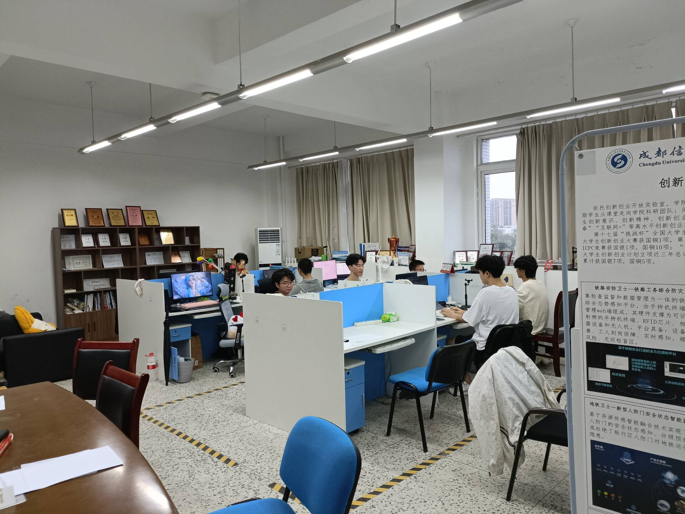

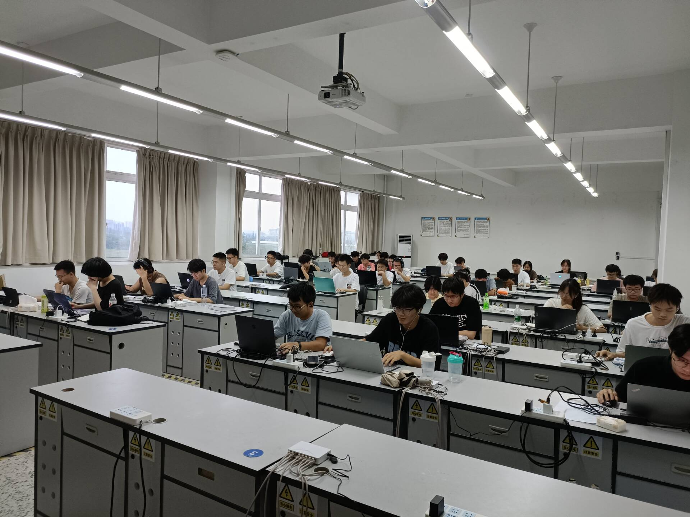

**2. 丰富的竞赛经历**

ACM 实验室会定期在校内组织个人赛，队与队之间的比赛，也会组织校级比赛，以丰富实验室成员的比赛经验。

ACM 实验室每年都会参加 ICPC 系列赛事、“蓝桥杯”全国软件和信息技术专业人才大赛、中国高校计算机大赛——团体程序设计天梯赛、中国大学生计算机设计大赛等专业类的比赛。

在往年的各式比赛中，实验室获得了许多荣誉与奖项。其中不乏高含金量的 ICPC 系列赛事金奖银奖。

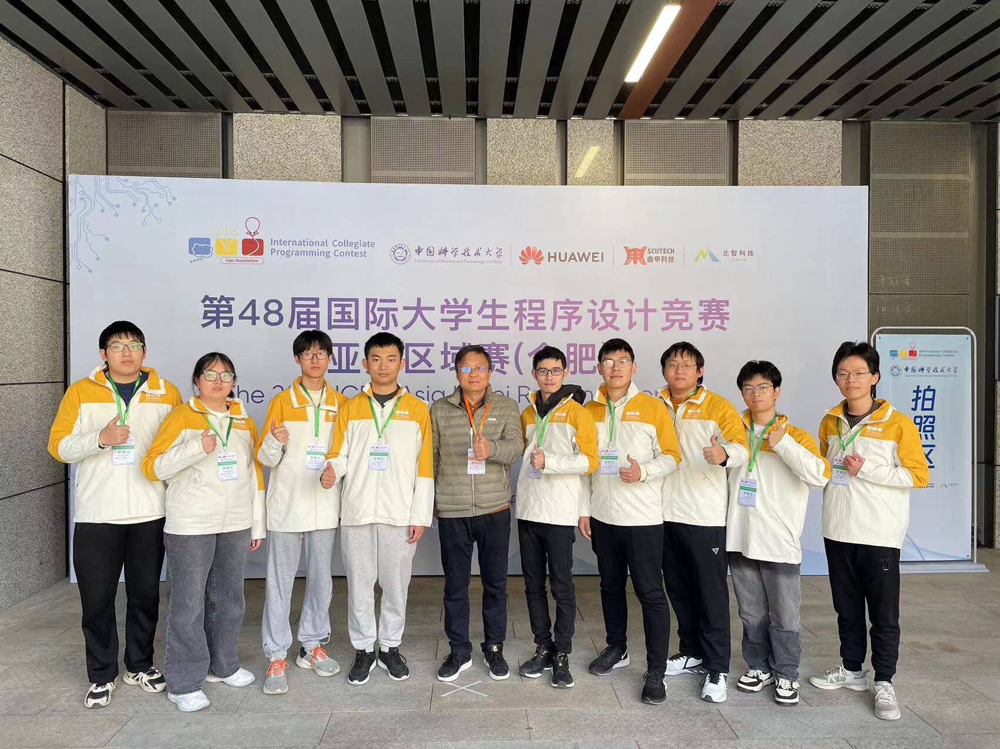

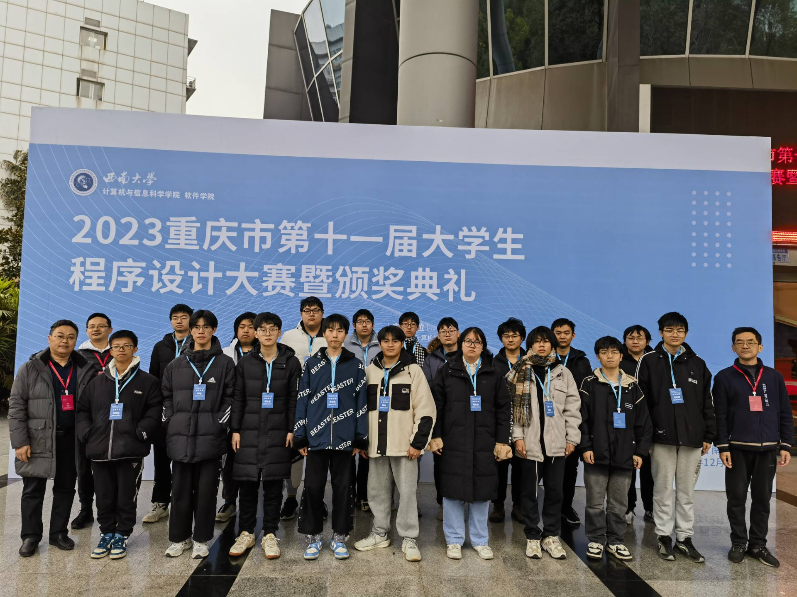

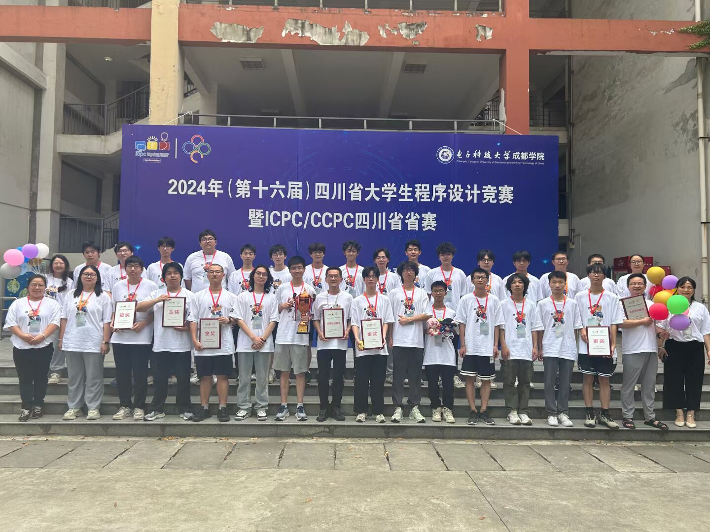

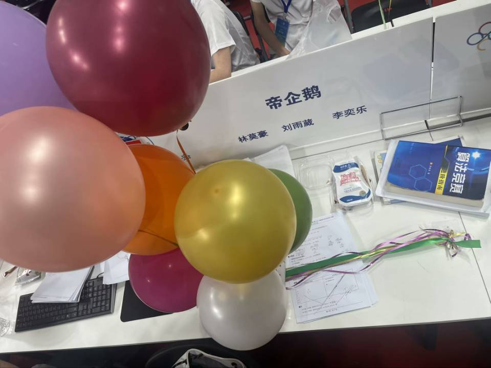

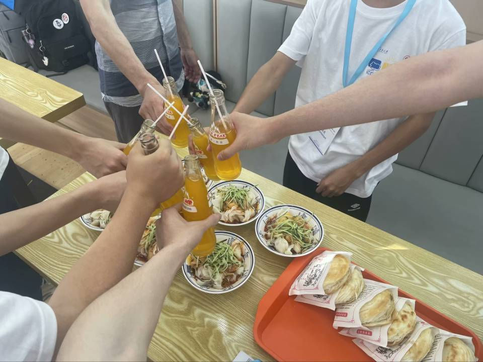

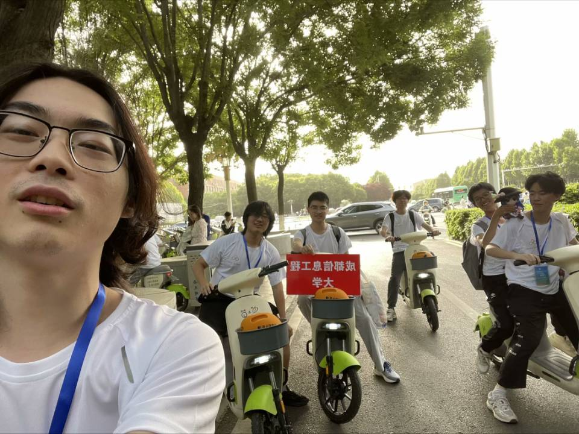

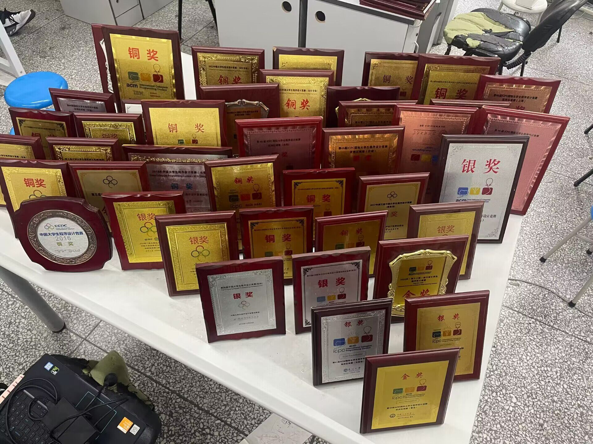

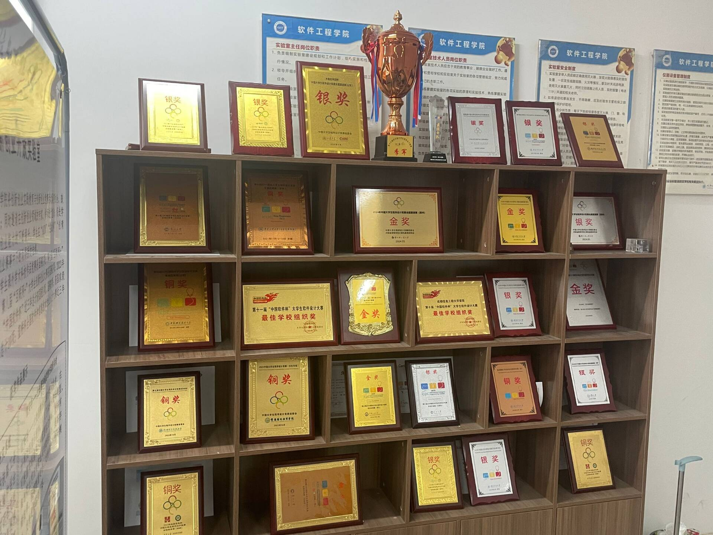

## 4. 如何加入实验室？

CUIT-ACM 新生交流群：758762821

想了解 CUIT-ACM 实验室的，都可以加群互相沟通哦。

**1. 招新宣讲**

在 9 月新生军训结束后，ACM 实验室会进行招新宣讲会。届时实验室成员会详细介绍 ICPC 系列赛事，并介绍 ACM 实验室以及实验室的招新安排。

**2. 集训**

**对于算法竞赛 0 基础新生：** 我们欢迎新生挑战 ACM 这个赛道，考虑到绝大部分同学是 0 基础，所以我们会从 C 语言基础带新生，对应的时间段每周五会讲一个专题以及发布对应的训练题单，题单必须达到对应的指标（根据题目难度动态调整，基础题必做），培训分为四个阶段：

- 秋季集训（大一上，国庆完新生军训后开始）
- 寒假集训（线上）
- 春季集训（大一下）
- 暑假集训（线下）

**招新流程分为一次招新与二次招新。**

**一次招新**：在**寒假集训**结束后，大约在 3 月份，我们会进行新生选拔。实验室现役成员会安排一场新生赛以及对有意愿加入实验室的同学进行面试，届时会选拔出新一届的实验室正式队员。

**二次招新**：对于没有参加选拔或未选上的同学，我们依然欢迎大家来参加后续的集训。在**暑假集训**时，实验室成员会组织数场训练赛。届时成绩优异的同样可以招录成为实验室成员。

---

**对于 OI 选手：** OI 是部分高中生打过的信息竞赛，一般来说打过 OI 的基础相对较好，如果你是 OIer，可联系群主，针对 OI 选手，会根据个人实力制定训练计划，**CF1600 分以上可直接进校队**，但大致与其它新生相同。

如果你是 0 基础也不用急，绝大多数人都是 0 基础，也有不少 0 基础训一年能打过 OIer 的，踏实跟着训练是完全可以的。

**贵在坚持，加油新生们！**

## 5. 学习与训练资料

**1. 套题**

新生优先套题：

[洛谷题单广场](https://www.luogu.com.cn/training/list)，可以先做入门题单。

**2. 学习网站**

[B 站 CUIT-ACM 算法竞赛实验室](https://space.bilibili.com/83744206?spm_id_from=333.337.0.0)：上面包含了历年实验室讲课的录屏。

[Codeforces](https://codeforces.com/)：可以说是目前全球范围内在算法竞赛领域最热门的网站之一。包含了海量的线上比赛以及丰富的题库，为算法竞赛选手提供了一个极好的训练平台。其 CFrating 更是评判一个选手实力的重要依据之一。

[洛谷](https://www.luogu.com.cn/)：国内的算法竞赛 OJ 平台，更适合中国算竞选手体质，有专门的训练题单与题库以及交流社区，也会不定时地举办线上比赛。

[OI Wiki](https://oi-wiki.org/)：OI Wiki 是一个免费开放且持续更新的知识整合站点。其中收录了许多竞赛相关的知识，包括竞赛中的基础知识、常见题型、解题思路以及常用工具等内容。