# MetaCrypto

## 简介

大家好，这里是区块链产业学院 MetaCrypto 实验室。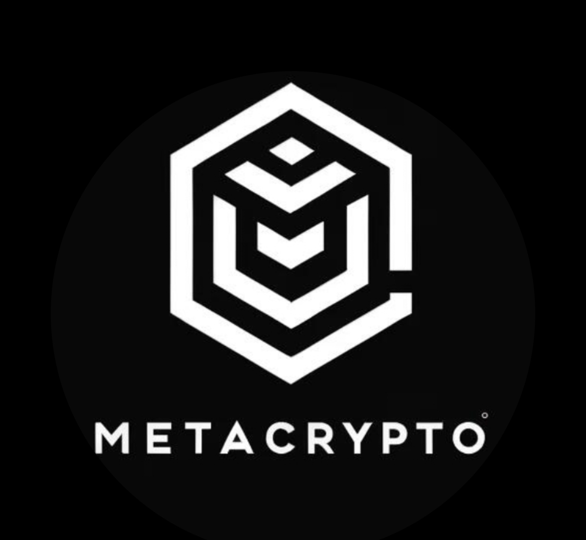

MetaCrypto 实验室成立于 2023.6，作为学校的新鲜血液，为学校的区块链，信息安全做出了巨大贡献。

主要的方向有：web，pwn，re，crypto，合约审计与开发，move。

同时我们积极为 web3 的发展做出贡献，开设与 sui 链共同开设 move 共学营，欢迎全校同学来 pr（暑假期间双倍 token 奖励），根据积分排名更有可能获得苹果手机！

同时，也欢迎一切 web3 爱好者与网络安全爱好者来 MetaCrypto 水群

招新海报在这里

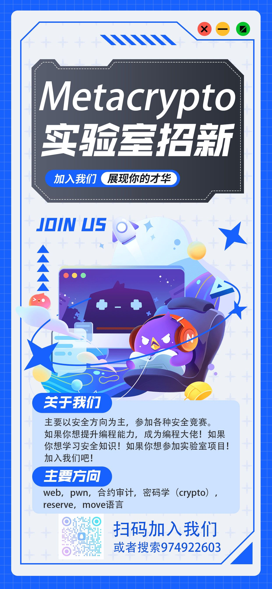.

下面简单介绍一下我们的六个方向（由于篇幅问题不过多赘述，欢迎来招新群看看群公告！）

### ctf web 方向

WEB 应用在今天越来越广泛，也是 CTF 夺旗竞赛中的主要题型，题目涉及到常见的 SQL 注入、XSS、CSRF、文件包含、文件上传、代码审计、PHP 弱类型等。这些题目都不是简单的注入、上传题目，至少会有一层的安全过滤，需要选手想办法绕过。且 Web 题目是国内比较多也是大家比较喜欢的题目。因为大多数人开始安全都是从 web 日站开始的

信息泄露、代码审计 Cookie 伪造、社会工程、命令注入、XSS 盲打、端口扫描、x-forwarded-for 绕过限制、orderby 注入、SQL 注入、搜索型 SQL 注入、SSRF 漏洞、CSRF 漏洞、PHP 反序列化、WAF 绕过漏洞、暴力破解、目录遍历、文件包含、任意代码执行、文件上传漏洞、任意文件下载、弱口令、隐藏字段、robots.txt、j2ee 框架漏洞、Strtus2 框架漏洞、PHP 反序列化、ZIP://伪协议漏洞、TOMCAT 漏洞、权限漏洞、业务逻辑支付漏洞、旁注漏洞、JS 前端校验等。

### ctf crypto 方向

CTF 比赛中的 Crypto 题目是专注于密码学（cryptography）挑战的一类题目。这些题目考察选手在密码分析、加密与解密、编码与解码、密码算法漏洞利用等方面的技能。

### ctf pwn 方向

Pwn 是 CTF 方向中的一种，主要是利用二进制漏洞从而获得 getShell(提权)，即获得对方系统权限，从而控制对方电脑。
Pwn 是一个黑客语法的俚语词，自"own"这个字引申出来的，这个词的含意在于，玩家在整个游戏对战中处在胜利的优势，或是说明竞争对手处在完全惨败的 情形下，这个词习惯上在网络游戏文化主要用于嘲笑竞争对手在整个游戏对战中已经完全被击败（例如：“You just got pwned!”）。

### ctf re 方向

逆向是指通过反汇编和调试等一些手段及工具，分析计算机程序的二进制可执行代码，从而获得程序的算法细节和实现原理的技术。不仅如此，逆向技能在信息安全面向的具体工作，如恶意代码分析、软件漏洞挖掘、移动安全以及对软件的破解方面发挥着巨大的作用。

### solidity

#### 什么是区块链？

对区块链最好的描述是将其描述为一个公共数据库，它由网络中的许多计算机更新和共享。

"区块"指的是数据和状态是按顺序批量或"区块"存储的。如果你向别人发送 ETH，需要将交易数据添加到一个区块中才算成功。

"链"指的是每个区块加密引用其父块。换句话说，区块被链接在一起。在不改变所有后续区块的情况下，区块内数据是无法改变，但改变后续区块需要整个网络的共识。

网络中的每台计算机都必须就每个新区块和链达成一致。这些计算机被称为“节点”。节点保证所有与区块链交互的人都有相同的数据。要完成此分布式协议，区块链需要一个共识机制。

#### 认识以太坊

以太坊（Ethereum）是一个建立在区块链技术之上的去中心化应用平台。它允许任何人在其平台上创建和使用通过区块链技术运行的去中心化应用（DApp）

通常情况下，我们使用的应用程序的内容由后端服务器提供，并将请求发送到后端服务器进行处理。例如，支付宝、京东等应用程序中的所有数据都由公司拥有。

然而，在去中心化应用中，前端用户通过自己的钱包管理自己的数据，而后端核心逻辑则通过智能合约在区块链上运行，实现了去中心化的信任机制。DApp 与客户端连接的节点只是网络中的一部分，它不会单独处理来自用户的请求（通常称为“交易”），而是需要将用户的请求广播到整个网络。在整个网络达成共识后，该请求才被视为已经处理完成。

#### 智能合约

智能合约是以太坊上运行的程序。就像其他计算机程序一样，它由代码和数据组成。智能合约中的数据通常被称为“状态”，因为整个区块链可以看作是所有数据状态的一个确定的记录。

关于区块链，可写的过多，篇幅问题，有兴趣进群了解

### move

Move 是一种专门为区块链和智能合约设计的编程语言，最初由 Facebook 的区块链项目 Libra（后改名为 Diem）开发。Move 旨在提高智能合约的安全性和灵活性，同时简化开发过程

MC 主要与 sui 链的 move 有合作关系，欢迎成为一名 builder 共同建造 sui move 社区

同时，MC 与 sui 将选出优秀 move 学员，为其提供一年份奖学金（以当前学年学费

为准，最终解释权由 MC&sui 所有）

## 加入我们，你能得到什么？

### 关于 web2

1.参加各种 ctf 比赛（iscc，xctf，DASCTF 等）

下面是小部分奖状（奖状有可能为实验室成员参与参加的）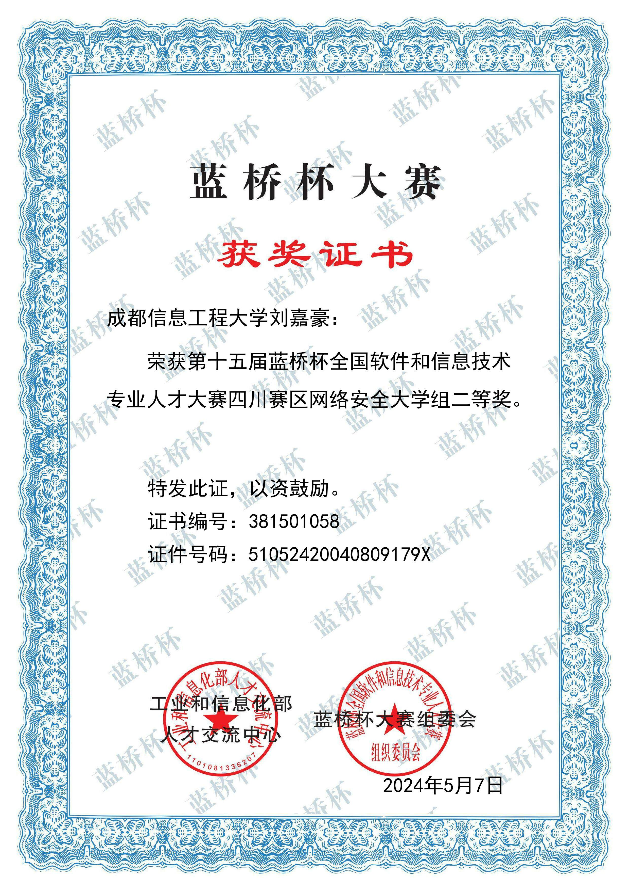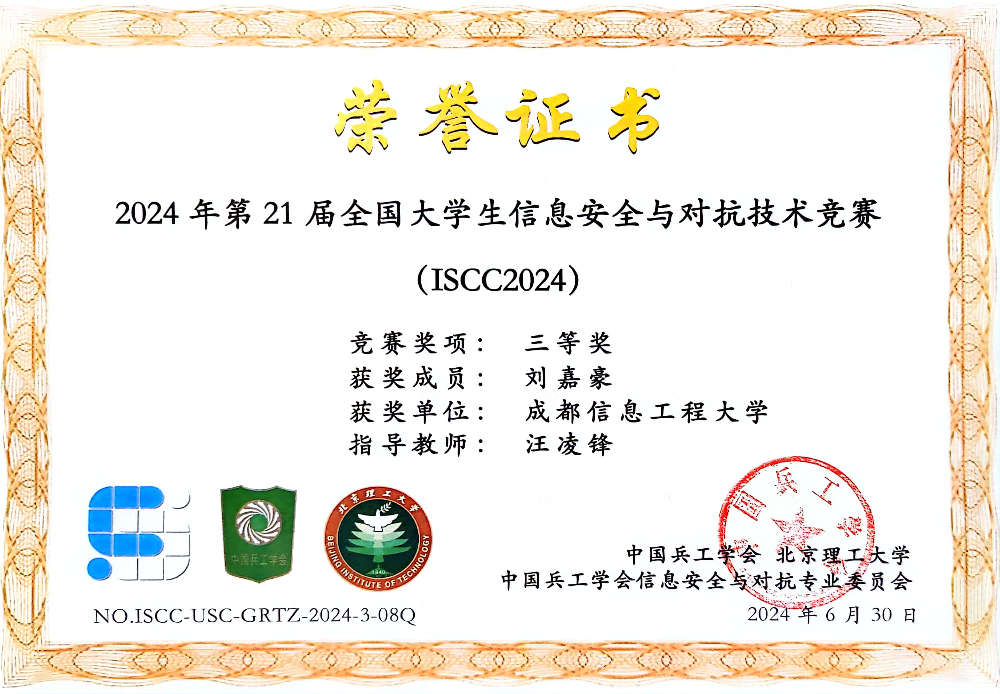

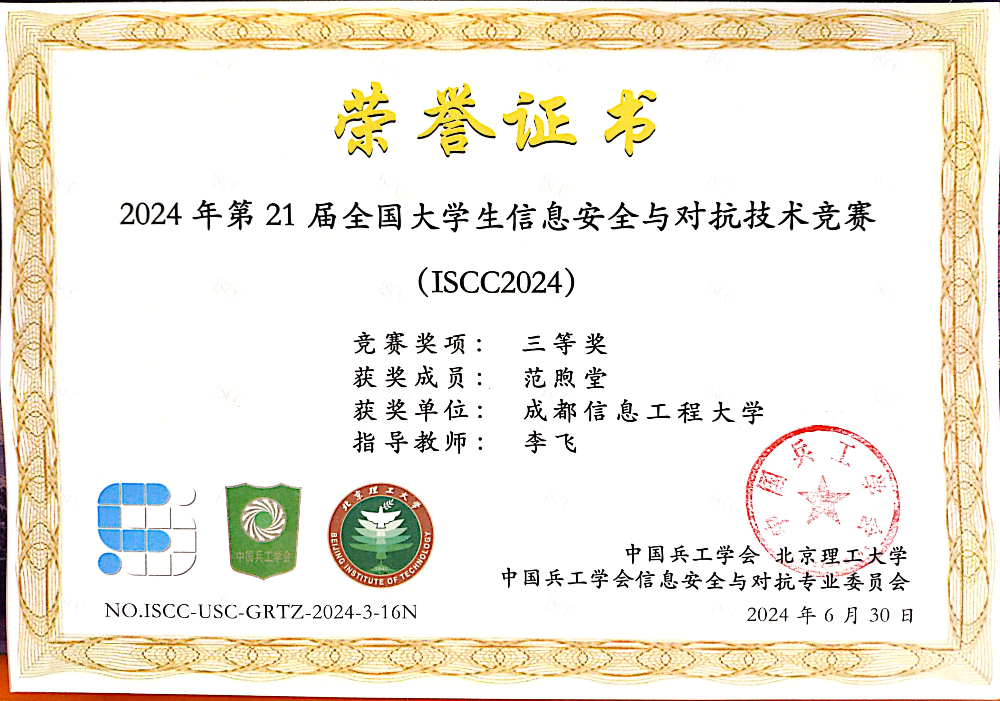

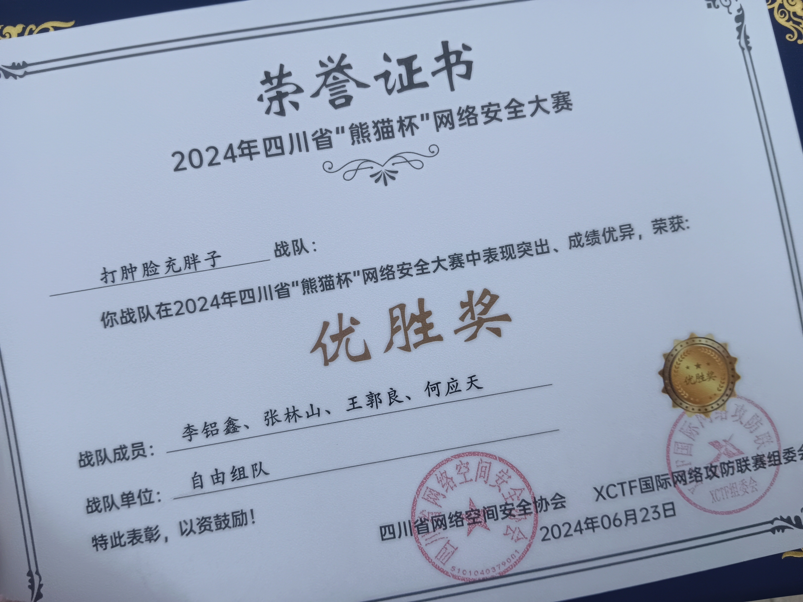

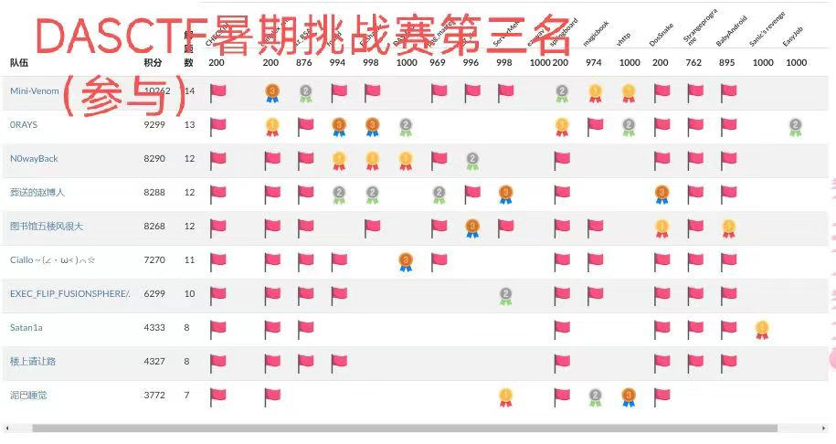

2.获得暑期安恒信息实训机会（与区块链产业学院长期合作），优秀学员将获得面试资格

3.获得暑期某行动内推机会（dddd）

4.参与挖掘各种 src，众测，cvnd 等的机会（学长手把手教手法）

src 参考价格：低危：三位数 中危：四位数（左右）高危（严重）:五位数（左右）

## 关于 web3

1.技术类：合约审计：

还是 iscc

23 年公费去北京理工打的比赛，作为学校唯一一队纯本科生冲出去的（成员全为本实验室核心成员）

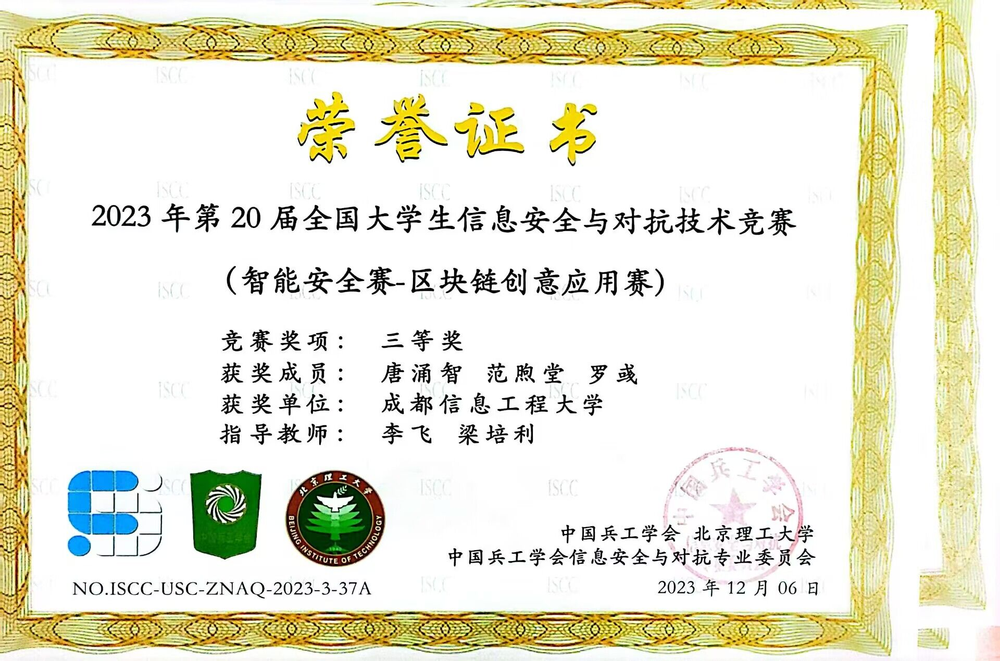

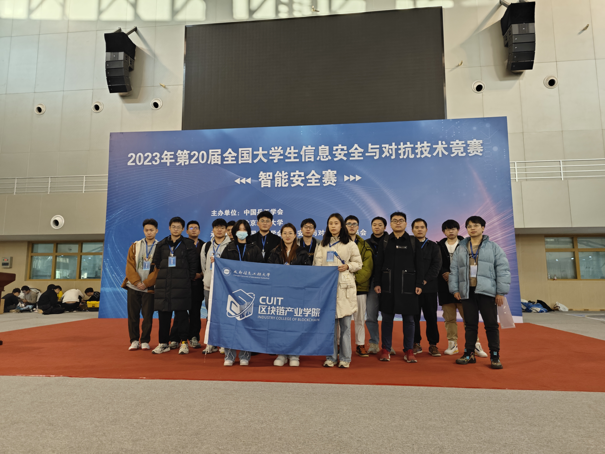

合约开发：

目前，在写这篇文章的时候，我们实验室的成员正在山东大学参加中国大学生计算机设计大赛（区块链专项赛），感谢学校以及学院的赞助（博主因 xx 原因，羡慕这两个字我已经说烂了）

由三位大二的同学带两位大一的同学

目前有省一的好成绩，希望他们在国赛中加油

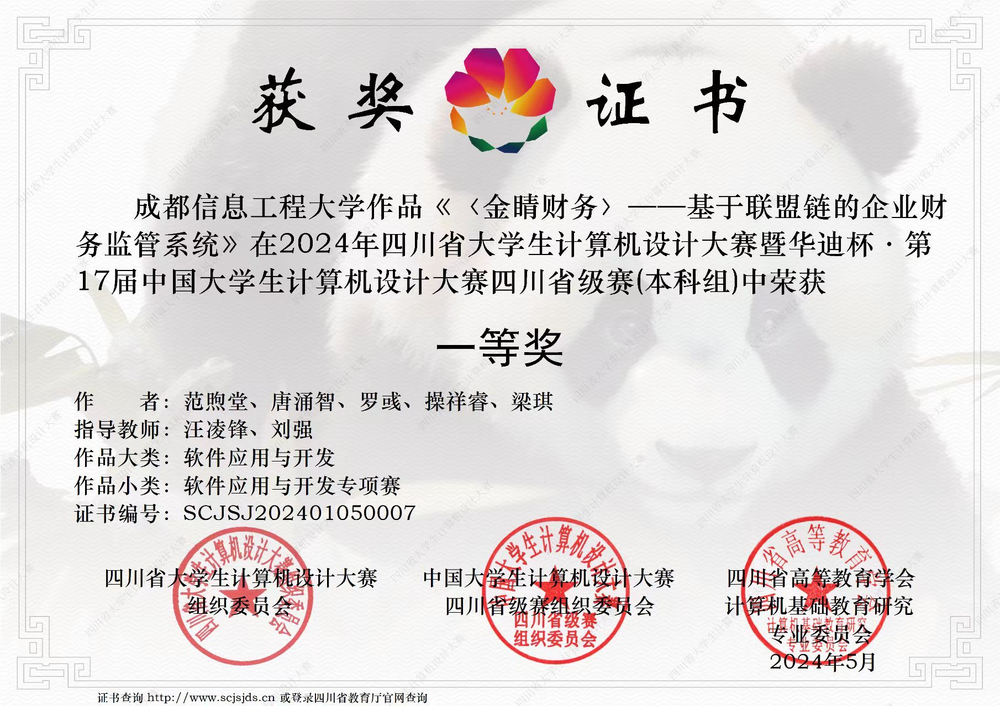

（ps：山东大学真的很好看）

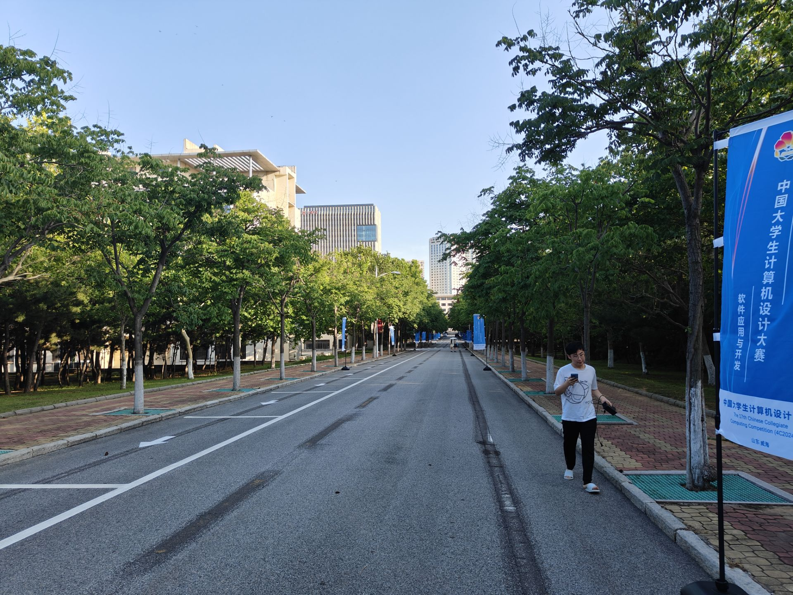

3.关于 move

作为 sui 链作为 21 年新成立的链，到目前社区生态已经很活跃了

sui 的项目方确实也很大方，博主同班同学确实也拿到了苹果手机，MC 这边的 move 负责人也确实获得了一年份的奖学金，共学营里天天都有 pr 拿 token。

其实上手拿 token 很快，我很喜欢我说过的一句话，勇敢的人先享受世界 -lukie.

4.群里不定时会有空投教程提供，尽量给大家选 0 撸，同时会由一些社区运营的实习岗位，或者文案之类的实习岗位给大家提供，非技术类的小伙伴也可以来玩！（另外 MC 收管理，有的群里 d 群主或社管）

来一点大一同学写的博客（我认为还不错的）

www.cryptoweaksheep.icu

https://404ll.github.io

最后，欢迎学弟学妹来 MC。老登也欢迎来水群撸空（狗头）
