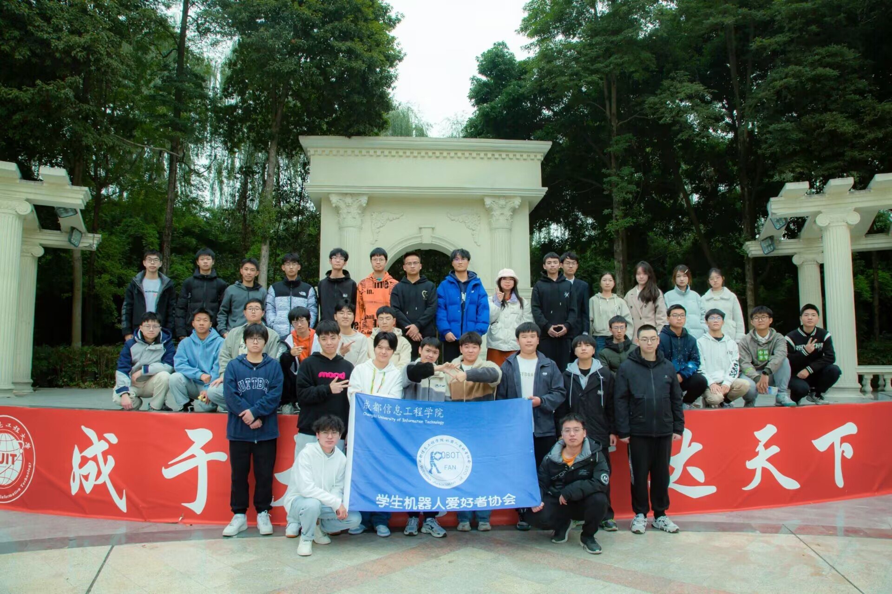
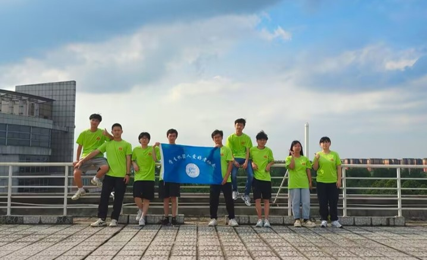
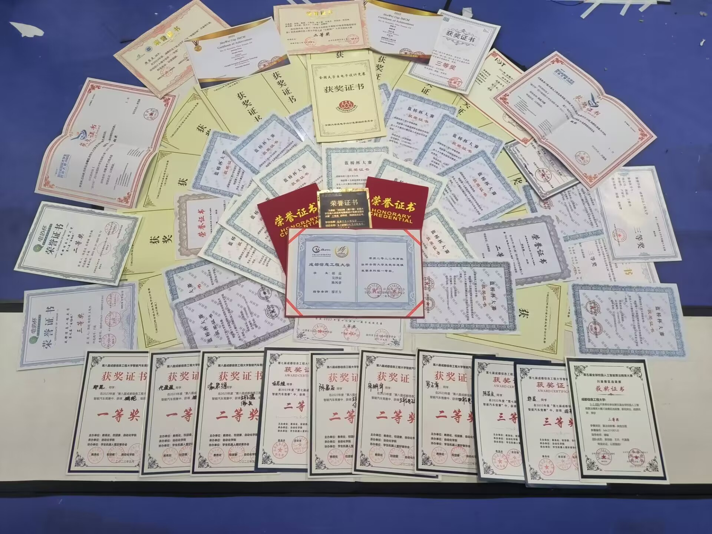
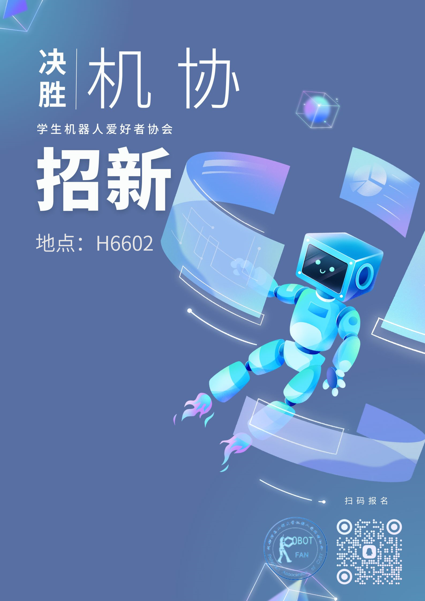

# 学生机器人爱好者协会

## 一、实验室简介
学生机器人爱好者协会（Robotfan Association），简称机协，成立于 2007 年，具有悠久的历史和深厚的底蕴。机协是以参加各类学科竞赛为主的科技类社团，在校内主要管理的比赛是全国大学生智能汽车竞赛。

协会一共分为 飞卡部、技术部、活动部、宣传部、财务部、办公室 六个部门，共同维系协会的运作，每一个部门都至关重要。

协会主要研究的方向大体上分为两部分，硬件和软件；协会成员会选择其中一个方向作为主要研究方向，通过软件员和硬件员的团队协作，完成团体比赛任务。

硬件方向：PCB 制板、3D 建模打印、机械结构 
软件方向：嵌入式、机器视觉、深度学习

## 二、付出与收获
参加实验室，最大的优势无疑是能够获得更多的资源。 
竞赛的奖项可以帮助我们积累远超常人的德育分和智育分，为我们赢得丰厚的奖学金；在考研复试中，手拿奖项的你会比其他的竞争者更具优势，更受导师青睐；工作面试，丰富项目经验能使你脱颖而出，收获到心怡的 offer。改变命运，就在此刻！

一分耕耘，一分收获。 
想要拿得到奖项，背后是需要付出极大的努力。可能你的同学还在寝室打游戏，你却要在实验室里奋力拼搏————写代码，焊板子，调车；在抓紧实验室的工作时，还要要求自己不能落下学业；别人都在放假了，而你还留在学校，只为更进一步……但正是这份坚韧和付出，才能带来丰硕的回报。

## 三、成果展示
**全国大学生智能汽车竞赛** 
**全国大学生电子设计竞赛** 
**全国大学生嵌入式芯片与系统设计竞赛** 
**蓝桥杯** 
**……**

## 四、招新流程
机协招新群 -18:957230531

欢迎大家进群了解！

## 五、培训规划
我们面对全校所有专业招新，招新对象为一年级和二年级同学。

在招新宣传结束之后，我们会进行相关的培训以及考核。对于一年级的同学，我们会安排专人带领大家入门，所以就算你是小白也不用担心，只要你有一颗热爱之心，那么我相信所有的困难你都可以克服！对于二年级的同学，要求相对来说会更高一点，除了培训要求的 51 单片机，还需要自学 STM32，最终会在面试环节进行提问。

最后我们会根据成绩依照排名来对新成员进行吸纳。成绩组成分为两部分，**平时成绩**与**考核成绩**； 
平时成绩包括培训的考勤，以及来实验室学习的次数，以及各组组长的印象分（来实验室学习的次数、培训作业的完成度、以及平时的积极度都会影响印象分），平时成绩的目的是为了给大家提供一个更人性化的考核机制，我们也相信一次的成绩并不能决定你未来的走向，但是态度真的能让人百尺竿头更进一步； 
考核成绩：考核成绩包括试题成绩和面试成绩。我们会在培训结束之后举办一次最终考核，考核试题的内容就是运用培训所教学的知识，完成相应的要求（包括绘制 PCB、在单片机上事项要求功能）。

**遇到困难时，请不要放弃，挺过去，你就能成为更好的自己**