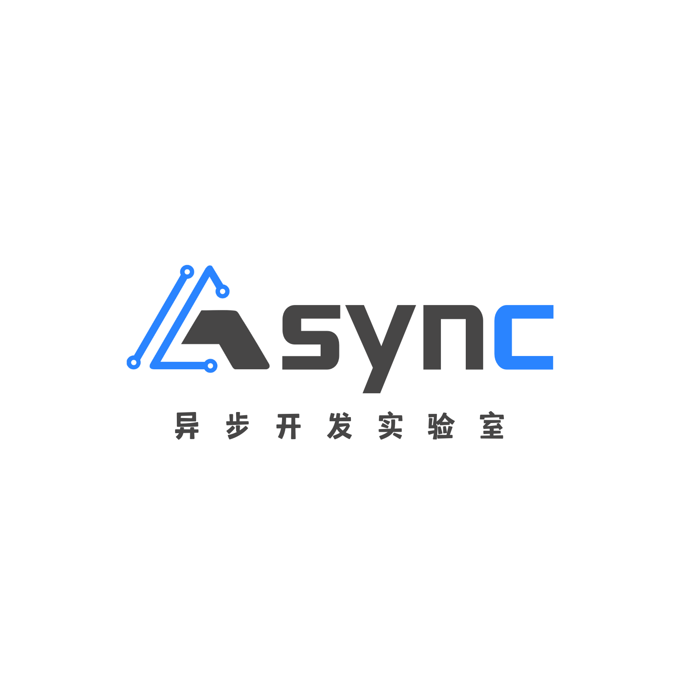

# 异步开发实验室

异步开发实验室全称 Asynchronous Lab，隶属于网络空间安全学院（前身为 IOTU），主要目前主要开设前端，后端（java，golang），移动端（Android），嵌入式等技术方向。异步，可能有的同学还不太了解它的含义。简言之，可以理解为两个人向他们各自的目标迈进，但是互相不用等着对方，只管自己有条不紊前进就好。我们不需要每个人的进度同步，只是希望同学们通过加入实验室，都能离自己的梦想更进一步，找到自己所爱，这也是实验室的意义所在。我们实验室，成立的初衷就是为了给各位喜欢开发，热爱创造的同学们，提供良好的学习氛围、安静的学习场所，以及与有着同样爱好的同学交流，共同成长的机会。另外，实验室于 2013 年成立，到现在已经有 9 年的历史了，所以会有很多已经毕业工作的学长给还在学校的我们提供很多帮助，⽐如互联网大厂内推，业界一线的情况等等

## 实验室介绍

实验室位于双中心 B413，拥有自己的实验室场地，可以提供良好的学习环境。
Async 有很多热心的学长学姐，能够帮助你们快速成长
Async 能给你许多锻炼的机会，让你有机会跟着老师做项目成长，或者自己独立经营项目。
Async 能将一群有着共同目标，共同爱好的你们聚集在一起，创造出大学里最美好的回忆！
Async 希望大家将写代码看作一件快乐无比的事情，希望大家能无悔于大学四年拼搏的汗水！

## 实验室愿景

希望各位同学能够 做好自己的职业规划，在学长学姐的帮助下努力学习最前沿的 IT 知识，在这场求职内卷之争中，前进到⼀线⽔平，最后斩获⾼薪 Offer。

伴随着学校课程的拉跨的是，IT ⾏业招聘越来越⾼的要求。由于⼤量的⼈涌⼊这个⾼薪⾏业，它的⽤⼈要求也随着 IT 产品的不断迭代⼀样，越来越⾼，在未来的道路上一定离不开团队合作，加入我们，在项目中共同进步，交流学习

## 实验室成果
实验室参加了例如蓝桥杯，机器人开发者大赛，算法设计与编程挑战赛，数学建模竞赛，信息安全竞赛，web 创新大赛，一带一路大数据竞赛，计算机能力挑战赛，传智杯等诸多赛事。

实验室也与 Google IO 等开发者社区举办了活动，进行了技术交流

## 学习之余

在学习之余大家也会举行团建，一起吃喝玩乐

## 技术栈

目前实验室开设了前端，后端 (Java,golang)，移动端 (Android)，嵌入式几大方向，且实验室设备齐全，拥有 3D 打印机等设备。此外，实验室还拥有 Minecraft 服务器，如果你也是 MC 爱好者就快来加入我们吧！

Minecraft 社区网址：https://www.asyncraft.club

## 招新

实验室欢迎所有对开发感兴趣的小伙伴
招新大群:308022463

二维码：
具体流程请看群中通知哦，有问题可以私聊管理！
