# 一、DSA 实验室是什么？

## 1.团队简介

DSA 全称 Data Structure & Algorithm（数据结构与算法），是由成都信息工程大学计算机学院建立，以参加各类程序设计竞赛为主的学生团队。

自团队成立以来，DSA 实验室组织培训全校学生参与 GPLT 团体程序设计天梯赛、蓝桥杯（软件类）、Robocom CAIP 等多项程序设计竞赛，曾获得过 GPLT 四川省高校冠军，蓝桥杯 C++B 组全国一等奖，ACM-ICPC 亚洲区域赛银奖，EC-Final 铜奖等众多奖项。

## 2.团队获奖

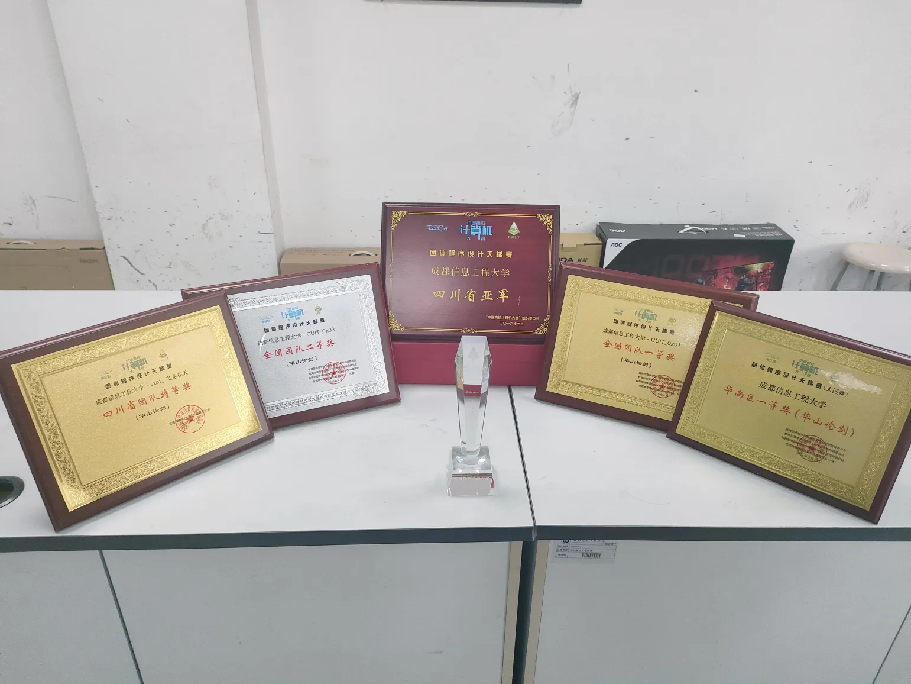

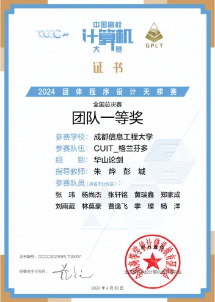
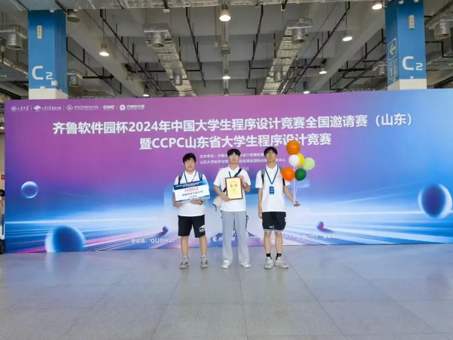

## 3.DSA 2024 招新群

欢迎大家前来了解~

# 二、参加比赛能获得什么？

## 1.比赛的奖项

毫无疑问，竞赛奖项是比赛能带来的最为直观的收获。

算法竞赛奖项是不少大厂甚至 BAT 公司录用的重要参考项，如果在简历上有这些方面的获奖项，会有效增加录用机会。

此外，在考研复试时，竞赛的奖项会成为衡量学生算法水平的重要参考，获得奖项可以在考研复试时得到更好的机会。DSA 实验室每年均有学长学姐考研上岸 985 院校，复试面试阶段中算法竞赛的经历就是他们最能与其余考生拉开差距的地方。

往近了看，在学校的评奖评优中，德育分和智育分是必不可少的，而参加比赛获得奖项，正是智育分最为重要的来源。参加竞赛并获取奖项，你就能在每学年的评奖评优中获得非常大的优势。

## 2.编码能力与程序思维的提升

算法竞赛对于编程能力的提升巨大，参加竞赛并努力取得一定成就的学生会必然具备三个非常出色且难得的基本技术能力：算法设计、快速编程和独立调试程序的能力。因为所有比赛都经过这样一个过程：给定一个问题，快速地设计出算法，快速地编写出程序。整个算法设计和编程过程中不断拷问自己的设计和程序，尽早发现漏洞、完善设计，最后在提交结果之前通过一系列的测试尽量提高程序通过竞赛评委测试的概率。经过这些锻炼后所获得的这三项基本能力在工作中非常有用。

## 3.在未来工作的笔试与面试中脱颖而出

在互联网行业，技术笔试大多必考算法题，有的企业笔试甚至只考算法题，这个环节对于竞赛选手而言可以说十分轻松。你可以很快的通过笔试环节（大概率全是编程题），并轻松地通过技术一面（通常是算法题）。

## 4.奖金

上面的内容看起来都比较虚幻，但这个就比较的实在了。

学校现行（2023 年末）的竞赛奖励制度如下：

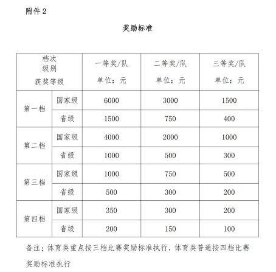

DSA 团队成员几乎均能取得蓝桥杯省二以上奖项（保底也有个 500 元），奖项最多的选手每年综合能拿到的竞赛奖金更是高达 12000 元。

此外，竞赛带来的智育分也能为团队成员取得等级奖学金，学校奖学金有以下几等：

- 国家奖学金 8000 元（每个学院至多 0.5% 的学生，如果无人满足要求则轮空）
- 特等奖学金 3000 元
- 一等奖学金 2000 元
- 二等奖学金 1200 元
- 三等奖学金 800 元
  DSA 队员们曾在去年包揽计算机学院全部的国家奖学金（3 位）与计科 21 级所有的特等 + 一等奖学金。

# 三、加入实验室能获得什么？

## 1.充足的参赛机会

DSA 实验室将会组织队员参与各类算法竞赛，队员们均会有较多机会参与比赛，挑战自我。

实验室每年会自主命题并组织 2~3 次校级比赛，如成都信息工程大学 - 团体程序设计天梯赛（CUIT-GPLT），蓝桥杯软件组校内选拔赛，睿抗 CAIP 编程赛道校内选拔赛等，部分校级竞赛也会邀请省内外其他高校同台竞技。

除此以外，实验室成员也将有大量机会代表学校参加 CCCC-GPLT，蓝桥杯，Robocom CAIP，ICPC/CCPC，SCPC，百度之星，码蹄杯等各类算法竞赛。

第九届团体程序设计天梯赛 - 赛前合影：

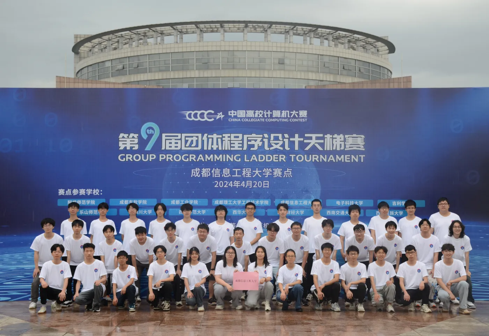

2023 年 ICPC 国际大学生程序设计竞赛 全国邀请赛（陕西）：

下图为一张颇有意义的合照，拍摄于 48th ICPC-EC Final（上海站）队伍 指引明路的苍蓝星 代表学校参赛，并首次获得 ICPC 中国区决赛铜奖，下图为苍蓝星的算竞朋友们（来自：西南民族大学，沈阳理工大学，湖南农业大学，西南石油大学的 EC Final 队伍）

## 2.固定的实验室场地

DSA 实验室拥有固定活动场地（第一实验楼 H5202 教室），可以为成员提供良好的学习环境与竞赛氛围，团队成员可以在实验室拥有固定座位进行学习。

PS：现在 H5202 第一排和最后一排都是奖牌，欢迎新生前来参观

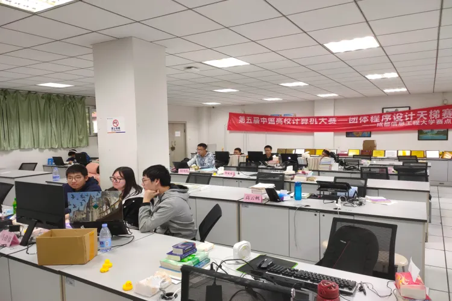

## 3.充足的创新学分、个性化自主学分、第二课堂分数

在 DSA 实验室训练时长达到 1 年、训练题量达到指定要求，根据成都信息工程大学计算机学院《个性化自主学习修读建议》，可提交申请获得个性化自主学习修读学分 2 分，作为毕业所需凭证。

除此以外，毕业要求的共计 6 分创新学分，在实验室参与竞赛可以很轻松的刷满。
第二课堂中科创分在实验室也能够轻松获得。

## 4.完整的训练计划与培养方案

实验室会展开周期性的培训，例行组织成员进行训练赛与讲课，并在每年寒假/暑假开展假期集训，帮助队员进行提升，拿到更高的奖项。

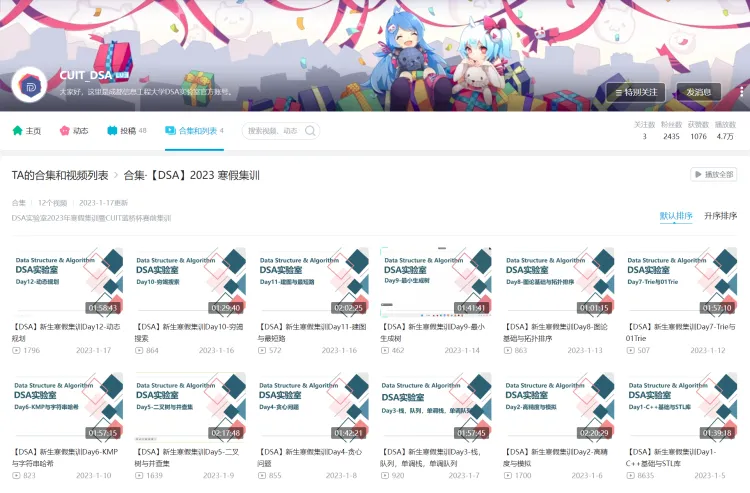

同时，实验室注重成员的学科综合素质，并为大家提供了多方向的培养路线与选择策略，帮助大家取得更多竞赛奖项的同时也帮助大家完善自己关于考研、工作等方面的学业生涯规划，并提供相应的学习机会。

PS：关注 CUIT_DSA 谢谢喵！

## 5.丰富的团建活动

19 级 赵钰学姐（2023 届考研 上岸中国科学技术大学）考研上岸经验分享：

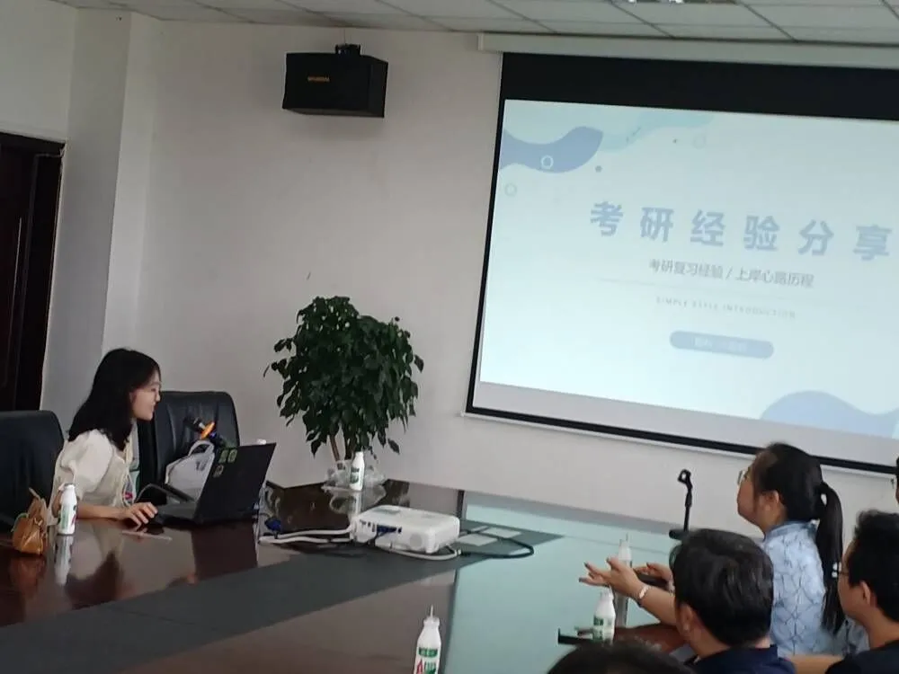

DSA 首次新老生经验交流会及集体团建活动：

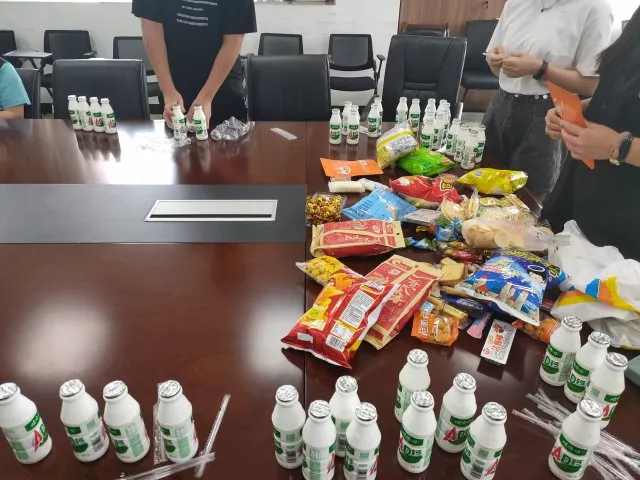

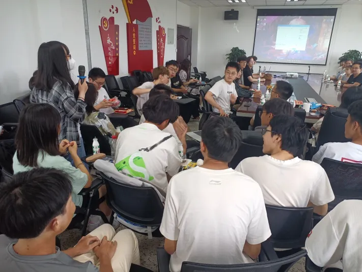
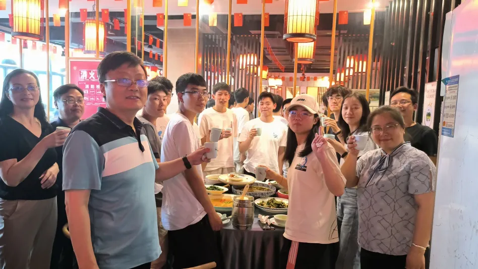

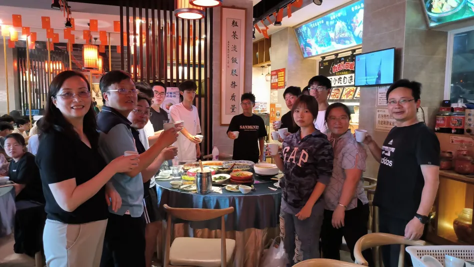
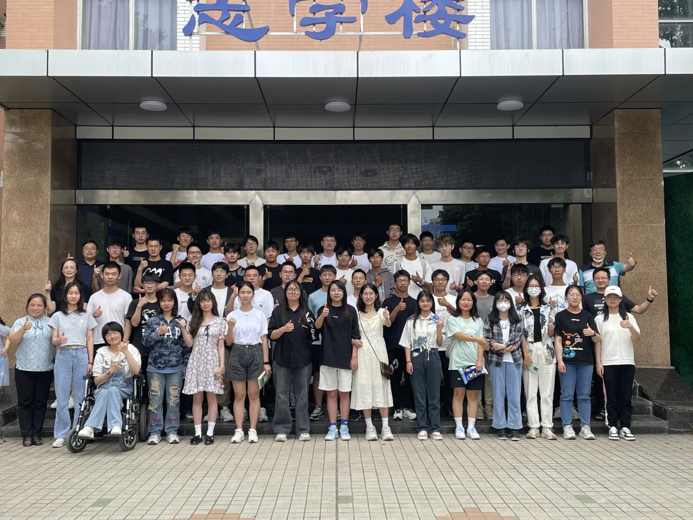

暑假集训期间来自教练的不定期投喂：

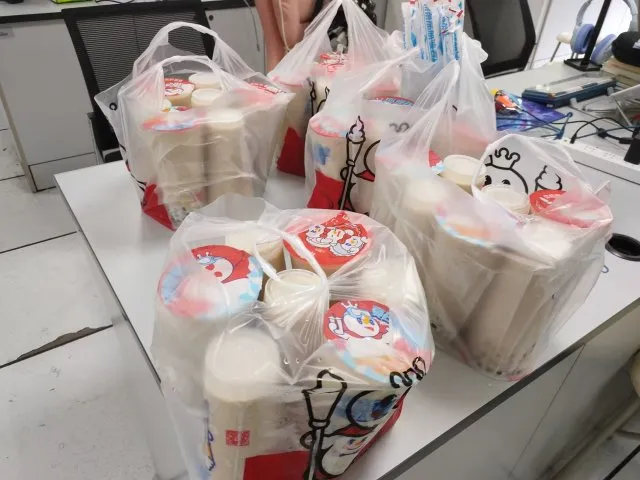

# 四、如何加入实验室？

具体可以参考《DSA 实验室制度》：https://www.yuque.com/books/share/58918979-3466-47fc-a492-e29a78cd5133?#。

团队招新分为三轮，对于每一届学生，三轮招新总共预计招新 20-35 人，不限学院专业，即使你的专业与计算机毫不相关也可以加入团队。

## 秋期一批（第一学期，10 月）

具备一定基础的一年级新生可提前参与招新。为了使在高中阶段具有 CSP-J/S 或 NOIP 参赛经历的、具有较好算法发展潜质的学生更早的参与到相关赛事中，在每年秋期新生开学后的 6 周内，由团队队长与团队管理负责进行一次技术面试，选拔有基础的新生作为预备队员提前进入团队展开训练。

## 秋期二批（第一学期，12 月）

在每年秋季学期第 12-14 周，DSA 实验室将会面向全校对算法竞赛感兴趣的学生进行正式招新。

本轮招新分为四个环节：

1. 招新初步测试  
   在 12-13 周开放招新题目集，达到相应分数可进入第二步面试环节。
2. 面试
   在每周末的固定时间，由团队队长与团队管理负责进行一次面试，通过此环节成为预备队员。
3. 寒假集训
   在寒假期间，DSA 实验室将会组织时长 12-14 天的寒假集训，预备队员需要完成寒假集训全部训练内容。
4. 招新测试赛
   春期开学 2 周内，将会针对达到集训要求的预备成员进行招新测试赛，达到测试赛要求即可进入实验室。

## 其他

一、在 DSA 实验室主办的比赛中（CUIT-GPLT，蓝桥杯校选赛等）获得优秀成绩者，可根据个人意愿，作为预备队员跟队训练，训练时间达到 2 个月可转为正式成员。

二、在各大网站（如 codeforces，AtCoder，牛客竞赛）上做题数量与 rating 达到较高要求，可作为预备队员跟队训练，时长达到 2 个月可转为正式成员。

我们欢迎所有想要深入学习算法竞赛，并能长期坚持的同学加入实验室，欢迎大家前来咨询。
