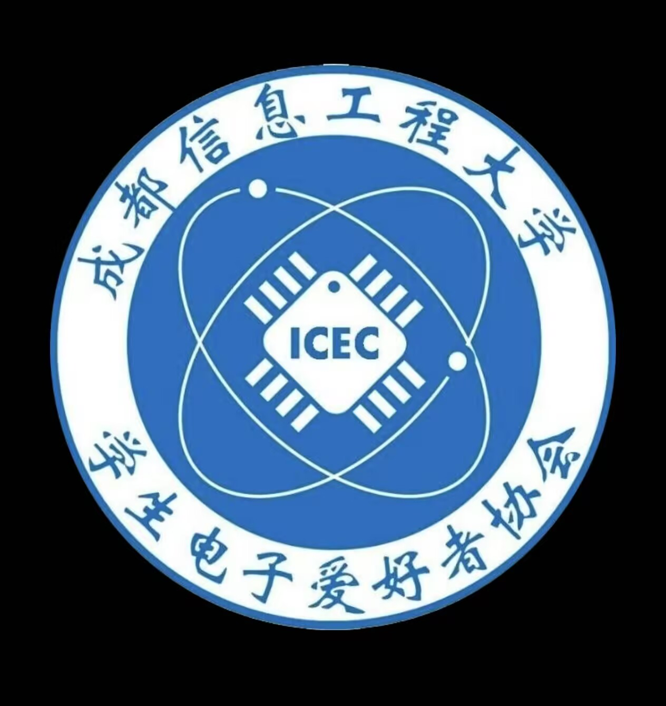
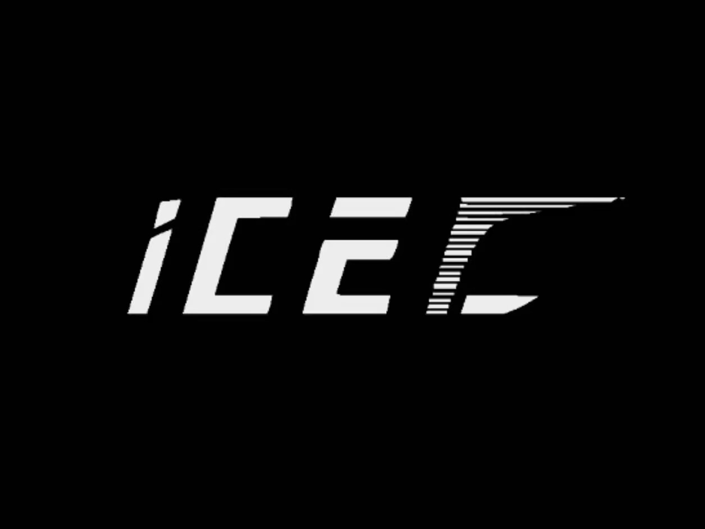
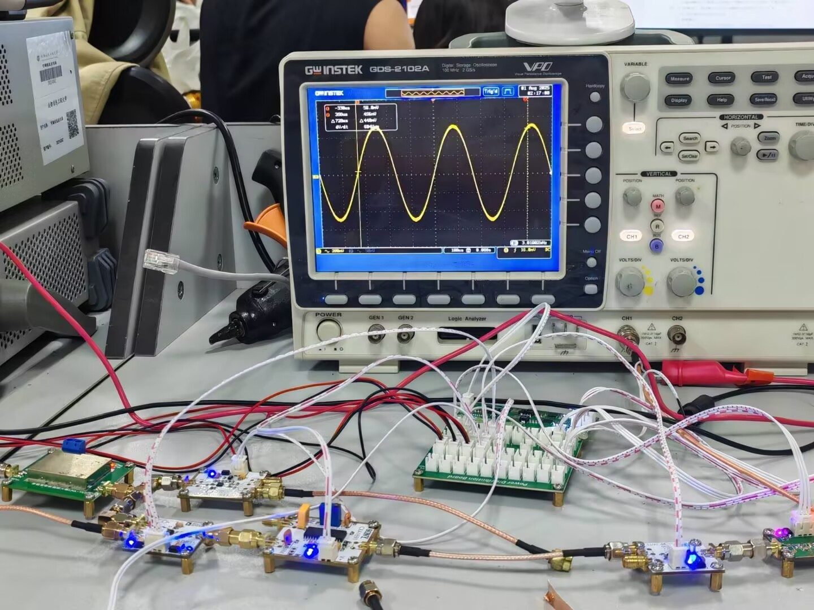
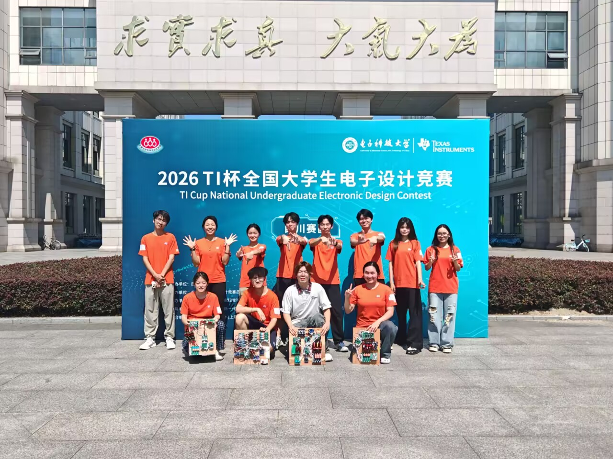
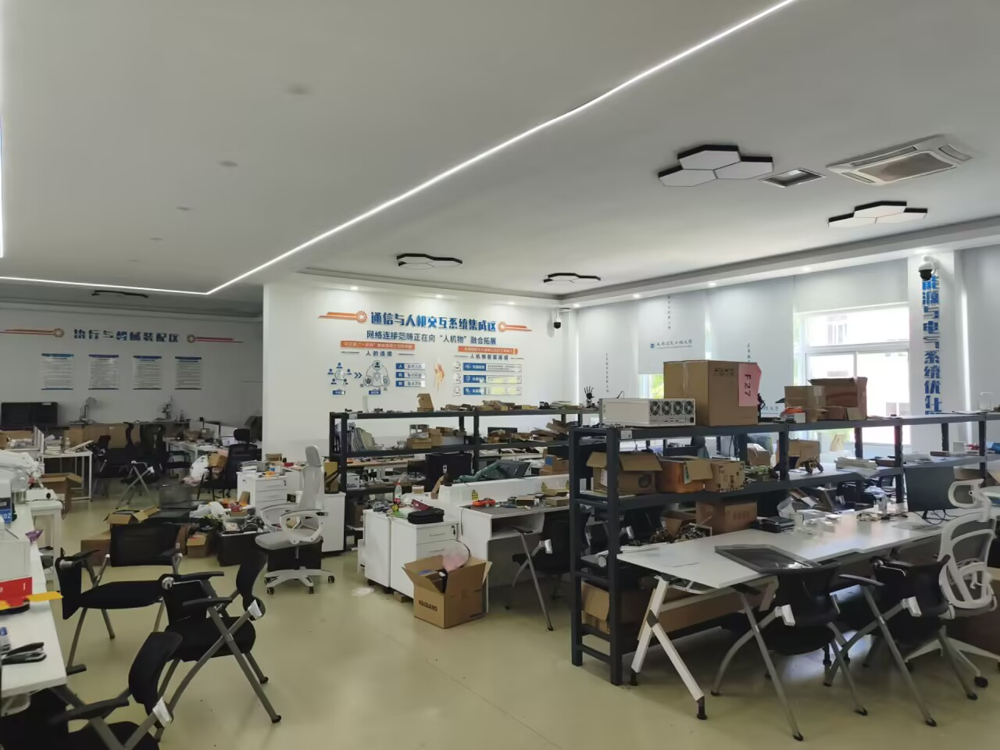
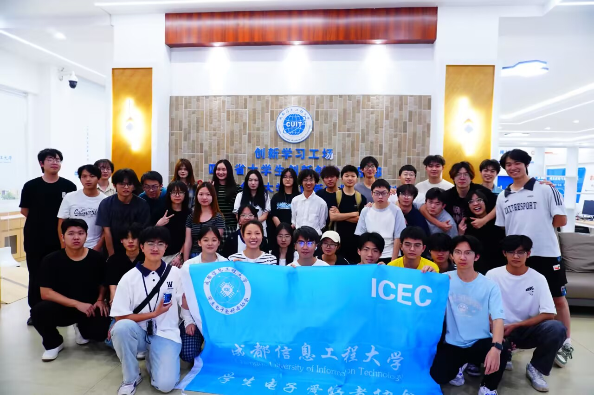
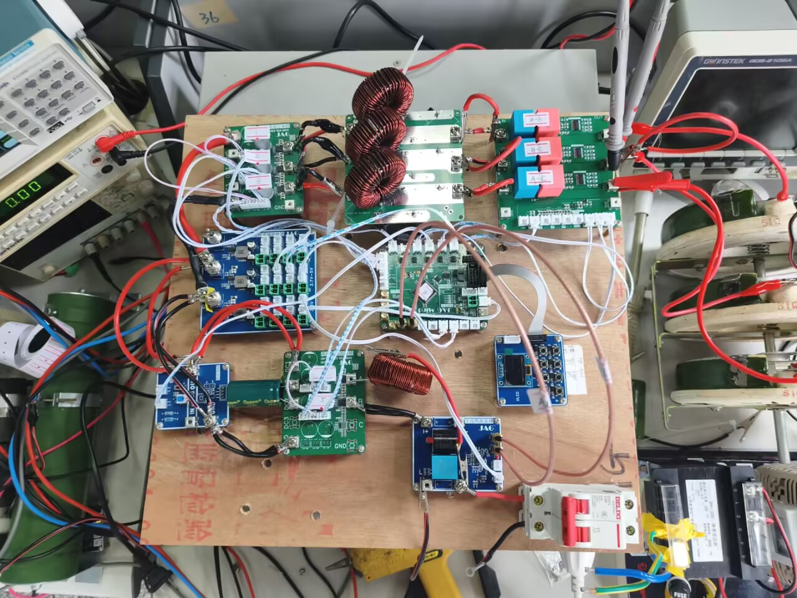
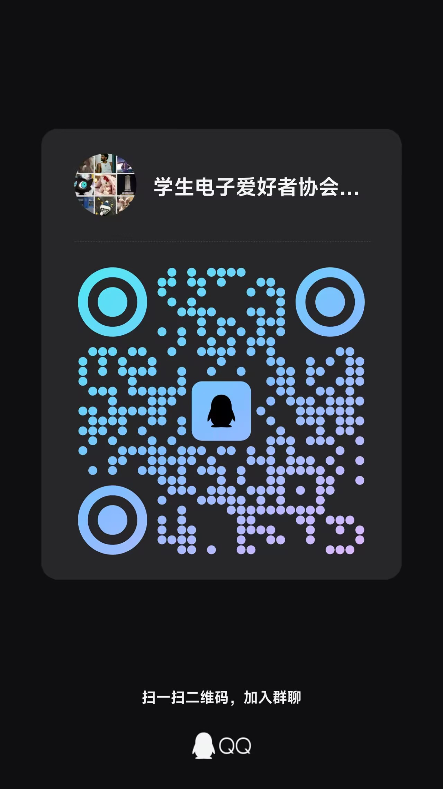

# 电子爱好者协会

# 加入实验室后，你将学习到

✨高频✨功率✨测控✨三个方向，均为基于单片机stm32学习的嵌入式，这三个方向，既有共同之处，也有差异化的侧重点。你不仅可以学习使用C语言进行MCU编程，也能学习如何使用重要的EDA工具，绘制PCB（印刷电路板）

# 加入实验室后，你将得到

各大电子类 创新类 科研类比赛渠道以及研究平台 如全国大学生电子设计竞赛 全国大学生嵌入式芯片与系统设计竞赛 智能车 蓝桥杯等等。
长达四年的专业知识，工程实践经验积累。
学习氛围极浓的学习环境。

# 我们的优势

实验室位置好 位于学校二食堂三楼创新工场，紧挨食堂，出行方便

实验室条件好 专业仪器设备齐全 示波器 万用表 直流 交流电源 功率分析仪 RCL数字电桥 满足你的科研需求。

实验室场地好 面积是单独教室的四倍，宽敞明亮，加入后有宽敞的工位，满足你的学习生活需求。

实验室实力强 协会创建于1999年，27年传承学长学姐经验丰富，国家级别奖项应有尽有，手把手教你电子知识。

# 招新渠道

招新群：[1095150649](https://qm.qq.com/q/g0HfmRAH3a)

