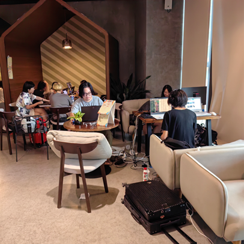
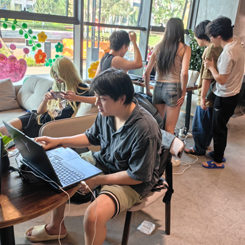
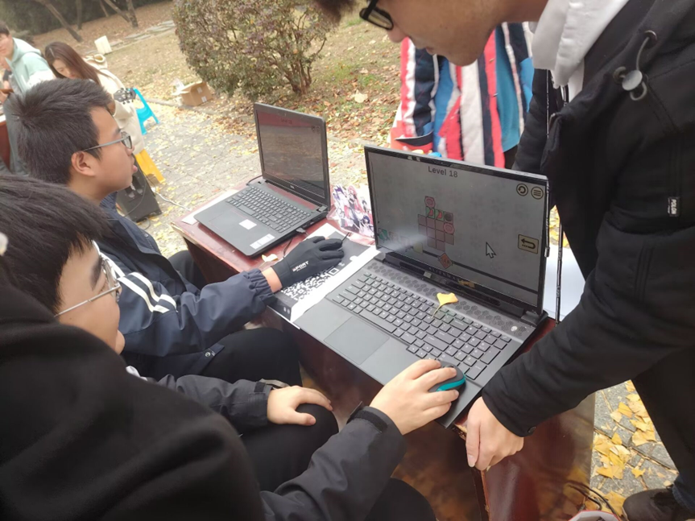
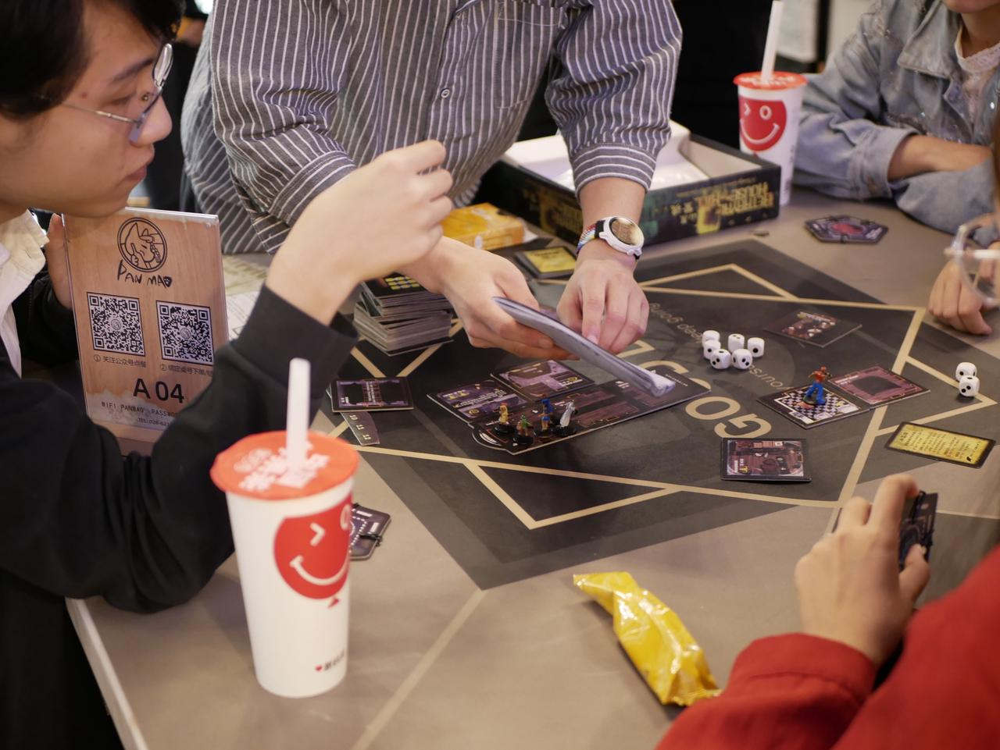
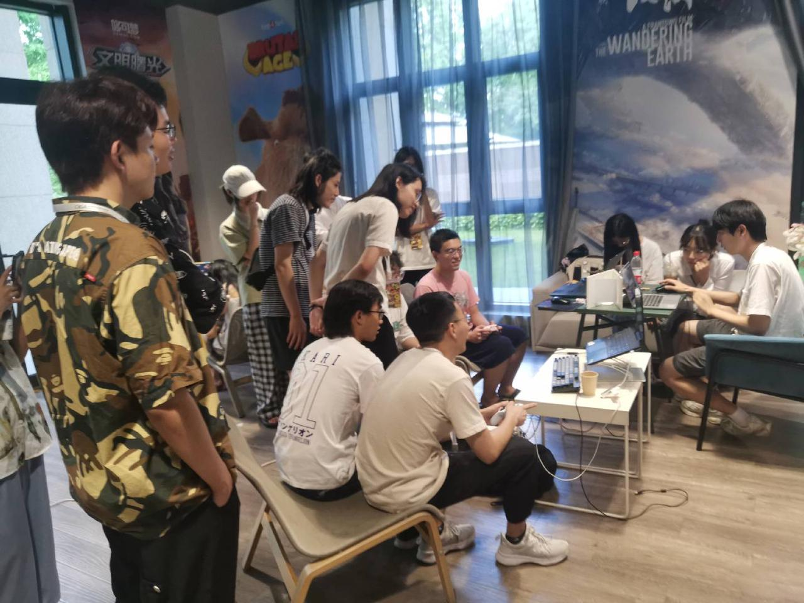
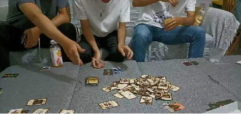
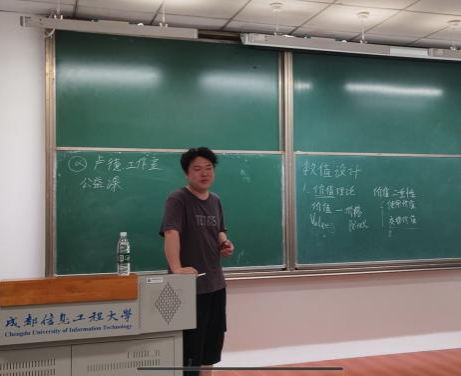
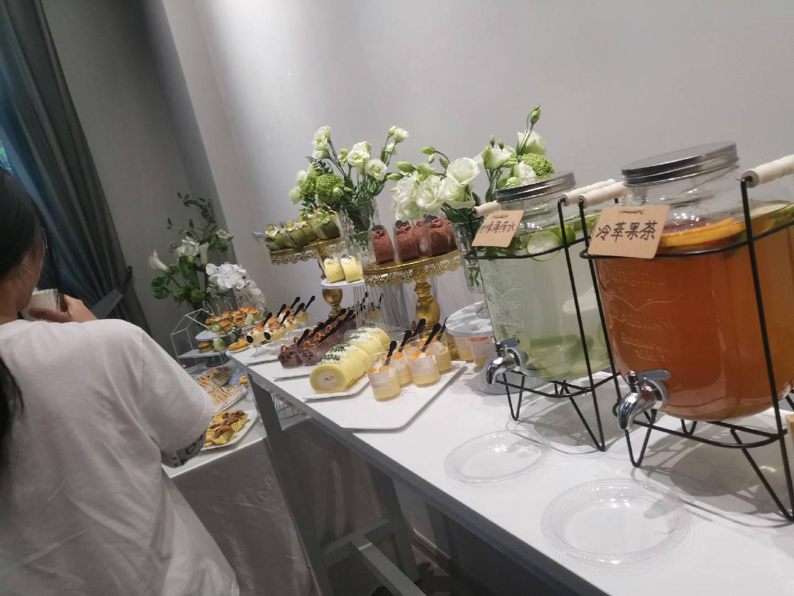
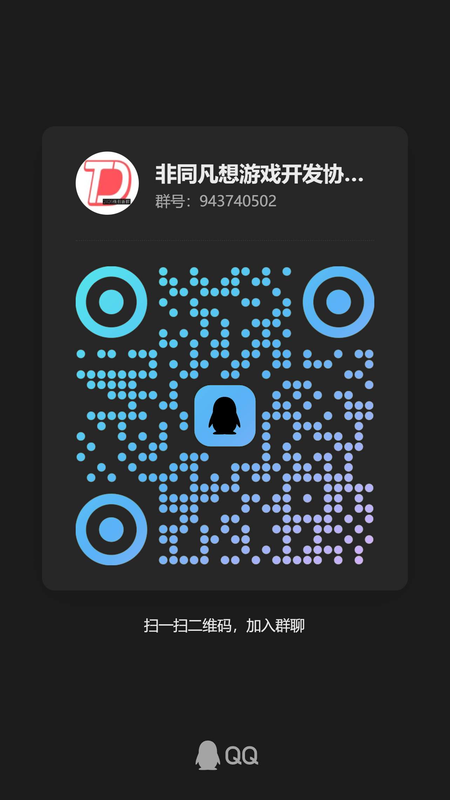

# 非同凡想游戏开发协会

非同凡想游戏开发协会（ThinkDifferentStudio，简称 TDS）是由以成都信息工程大学学生为主体的大学生创业团队创建的游戏开发组织，初创于 2021 年 5 月，成立至今已有 5 年时间，正在逐渐形成完备的内部人才培养体系和标准的内容生产规范管线。

非同凡想游戏开发协会致力于打造游戏领域的高品质虚拟内容。有游戏制作与影视制作两大方向，总人数 50 余人。秉承着“热爱游戏 | 尊重人才 | 宁缺毋滥”的理念。

截止目前，我们的成员内已有许多应届或未毕业的成员前往国内知名游戏公司工作，包括但不限于**腾讯游戏，网易游戏，米哈游，莉莉丝游戏，散爆网络，西山居，数字天空，龙渊网络，迅游等**。

我们希望构建一个对游戏制作充满热爱，对游戏保佑热忱的土壤，让大家能在这里尽情发挥自己的创意，交流自己对游戏的看法。一起进步一起学习，无论是在学习还是在生活中都能够一起面对。

## 我们有什么

在协会中，我们有许多已经在公司里工作，或者是一些正在学习的前辈，大家都会乐于帮助萌新的疑问解答。我们的学长也能够提供诸如等公司的内推 (要自己能把握住哈哈哈)

无论是在严肃的开发问题 (虽然游戏开发不应该严肃),还是轻松的讨论中，大家都有快乐讨论氛围

你将可以在与大家的沟通中学会合作，相互帮助的重要性，你将获得与你相互扶持，一起学习的朋友。

## 非同凡想能为你带来什么

丰富完备的学习资源与学习路线
在协会内部，我们分别设立了**程序组**（包含客户端方向与图形方向），**策划组**，**美术组**，**web组**，**音乐组**（正在筹备重生中），其中我们的**程序组**，**策划组**和**web组**均拥有完备的学习路线与学习资源，音乐组和美术组更偏向爱好者交流地，并不能提供专业性较强的体系性培训（还望大家能理解，毕竟咱们是理工科类的学校）

各个组的招新文档:
程序组招新总文档:[【TDS】程序方向招新-CREATE A NEW WORLD](https://thinkdifferent-club.feishu.cn/wiki/XH9gwA8sSi6Pvik4yS4c4zKPn1e?from=from_copylink)
- 客户端方向招新文档:[【TDSC】客户端方向招新](https://thinkdifferent-club.feishu.cn/wiki/KboKwWuami14ftkbrPJcGG5inof?from=from_copylink)
- 图形方向招新文档:[图形方向招新文档](https://thinkdifferent-club.feishu.cn/wiki/UTOdwugsNiVXtckjt5CcmK8pn7b?from=from_copylink)

策划组招新文档:[非同凡想游戏开发协会之策划组介绍](https://my.feishu.cn/wiki/B8CtwED86iIYvHk0t0WcugvAnze?from=from_copylink)

美术组招新文档:[美术组介绍](https://ccnetgsxmnxg.feishu.cn/wiki/TeDIwUL1Ci8rVSk4Vf9cOor8ndf)

web组招新文档:[【TDS】 2026 Web开发组招新文档](https://thinkdifferent-club.feishu.cn/docx/Wnadd4GIOobKeaxIvQDcHuB3n0e?from=from_copylink)

音乐组招新文档：[【TDS】旋律再起，共谱新章 - 2026音频组招新](https://thinkdifferent-club.feishu.cn/wiki/TFuIwD2wAiE9jmkCNMKcNy3knYe?from=from_copylink)

## 我们的团建以及比赛活动

### 参加线下游戏开发比赛

### 大家一起来玩游戏

### 搬东西

### 卢德工作室宣讲

### 聚餐

## 我们如何招新

我们的招新群：***[943740502](https://qm.qq.com/q/4jUwQ1upOo)***

