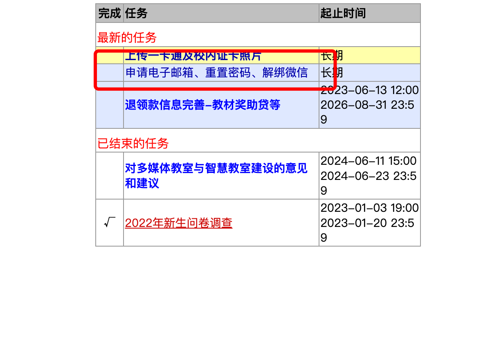

# 学校邮箱的福利与申请方法

## 邮箱福利

可以使用 EDU 邮箱申请诸多教育福利优惠，自行百度/Google`教育邮箱福利`

例如可以白嫖一些旗舰软件的专业会员：

> [JetBrains](https://www.jetbrains.com/student/) – 免费使用旗下大部分软件，如 IntelliJ IDEA、WebStorm 等

> [Figma](https://figmachina.com/guide/managing-your-account/setting-up-your-education-account.html) (原型设计旗舰软件)

## 如何申请

1. 进入信砖的[计算中心](http://jszx-jxpt.cuit.edu.cn/Jxgl/Xs/netks/sj.asp)

2. 选择疫情防控：
> 

3. 点击申请即可：
> 