# 我们该怎么开始Go？

很荣幸今年能和大家一起学习这门语言。对于有Java基础的同学，可能对go的语法一开始有些不适应，但是很快你就会被他的简洁高效所吸引。而对于零基础的同学，学习go反而更简单一些，正因为没有传统语言的基础，才不会被惯性所束缚。由于golang在回声实验室经历过一次断代，我们今年的招新也会适当降低难度，对项目的要求不会太严苛。

## 起步：下载安装
go的简洁从下载安装就可以窥见，前往官网下载，接下来就是傻瓜式的安装——一路连点next。有一点需要提的是，安装路径中一定不要包含中文，不只是go，接下来的所有编程学习中，尽量都要防止路径中出现中文。
**提前单独创建一个文件夹，记得是文件夹！，可以命名为“Go”，将其设置为安装路径**
go下载地址：https://go.dev/dl/
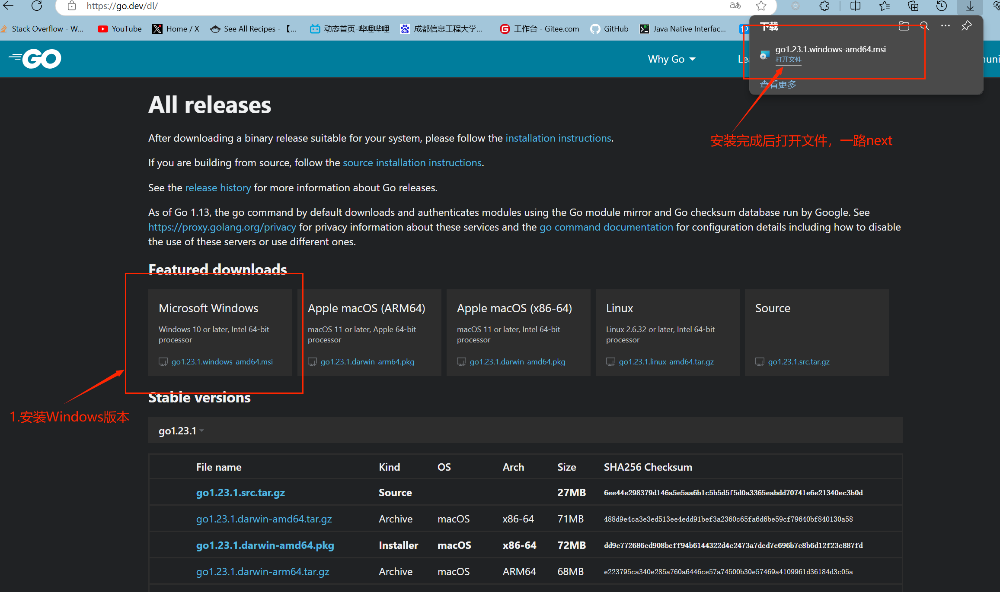

### 验证是否安装成功
按住win+R，输入cmd，在终端输入 `go version`,出现go的**版本号**，恭喜你，安装成功啦！
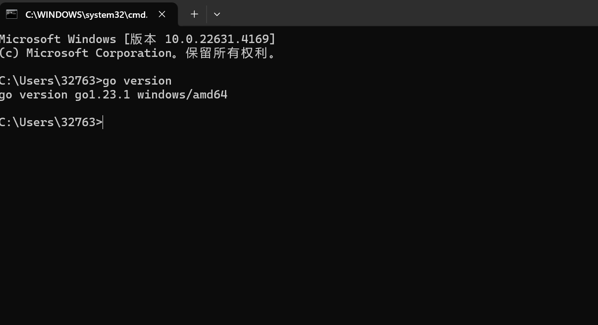
---
## 环境搭建：配置环境变量
已经安装了JDK的同学对这个可能不陌生，go的环境变量配置也一定要一开始就要做好，同样的简洁，在go中我们只需要配置两个环境变量：GOPATH和GOROOT，前者是我们Go的工作区（写代码的地方），后者是我们Go的安装位置，即我在上文所说的文件夹Go。
#### 可以参考我的配置
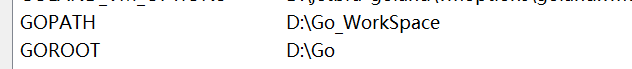
### 如何配置环境变量
1. 打开搜索框，搜索“编辑系统环境变量”，点击
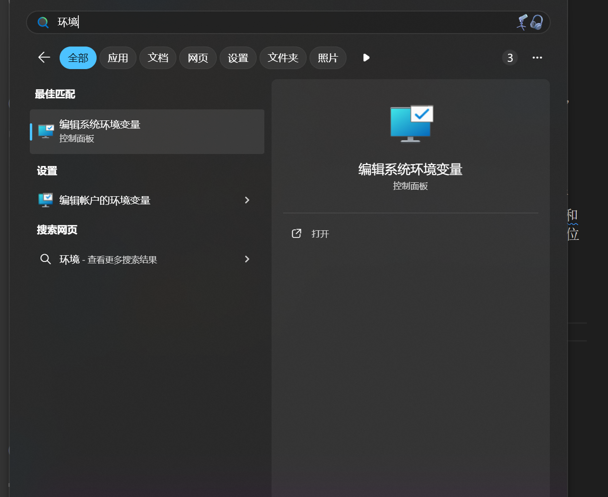
2. 按照图中步骤，新建环境变量。GOROOT中填写Go的安装位置。**提前创建好Go的工作区文件夹，GOPATH中填写这个文件夹的位置**。有的同学可能GOROOT在安装go的时候已经自动帮你配置了，再检查一遍就好

3. 在Go的工作区文件夹创建三个文件夹，分别为bin、pkg和src，我们之后所有的代码都会在src中编写
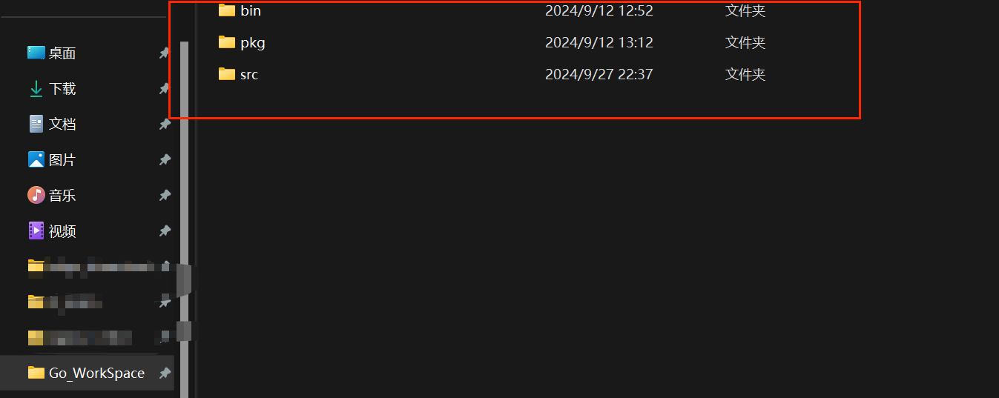
4. 恭喜你，环境搭建完成，接下啦就可以开始Go的代码学习了！
---
## 进阶：Go mod的使用

go mod是官方提供的依赖管理工具。看不懂没关系，先记住它是什么，且听我细细道来。
### 包的定义
在Go中，规定代码们都要有自己的“包”，就好像员工要属于自己的公司一样。而**一个目录下只能存在一个包**，其中，**main包被设定为程序的入口**,只有main包下的main函数才能“跑”。比如以下示例，我想启动一个名为main1包中的代码，程序就会报错，提醒我不在main-package中
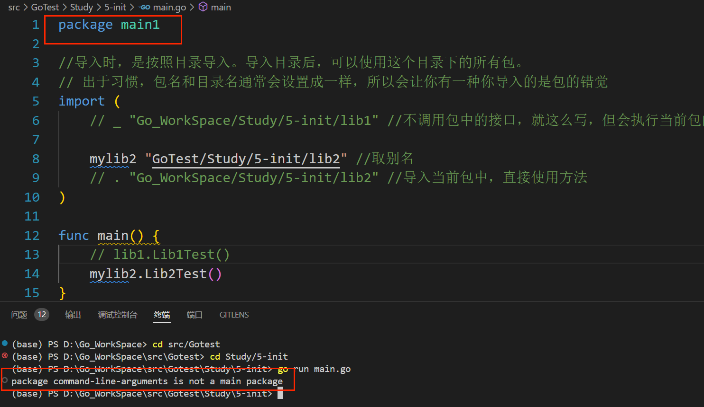
在我改名为main后，才能运行成功
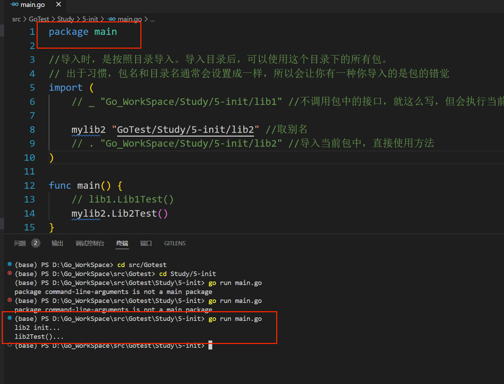

### 导包
大家应该注意到了上面的代码中import中的内容，这里被称为“导包”，即我可以在当前的包中调用其他包中的代码，好比一个公司想要使用其他公司的员工、业务什么的（原谅我的修辞水平非常匮乏）。
但实际上在go中，**我们导入的是目录而不是包名**，但是一般目录名和这个目录中的包名会设为相同，这才有了导包的错觉。
可以看到在上述代码中，我导入了目录lib2，这是我的目录结构
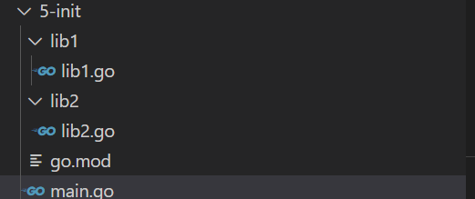
导包之后，我的main包就对lib1产生了**依赖**，而随着开发的深入，我们的包越来越多，各个包之间的依赖关系也变得越来越错综复杂。该怎么管理它们呢，于是我们就需要借助**依赖管理工具go mod**

### 为什么使用go mod
一般来说go在导包时会扫描两个路径，即我们先前配置好的GOROOT和GOPATH，GOROOT是安装go的路径，里面有大量的官方工具包，go程序会直接扫码他们。当我们想写自己的包时，我们自己的代码是在GOPATH路径下的，然而**在不使用go mod的情况下，go默认只扫描GOROOT路径**，这就导致了我们自己编写的包无法被正常使用。
当然，以上只是使用go mod一个小小的原因，我们完全也可以把自己的包加到GOROOT中来解决这个问题（不嫌麻烦的话），go mod真正效用在后面才能体现出来，正如pnpm对于前端，maven对于Java（别慌，这两个以后你都会学到的，很简单），想成为真正的go开发者（画个饼），go mod是必不可少的

### 开启go mod
1. 首先，还是打开终端(什么位置打开都行)，输入`go env`，我们就可以查看go的所有配置信息，其中有一项是`GO111MODULE`，它表示go mod是否开启，一般来说都是`auto`，我们需要将他修改为on
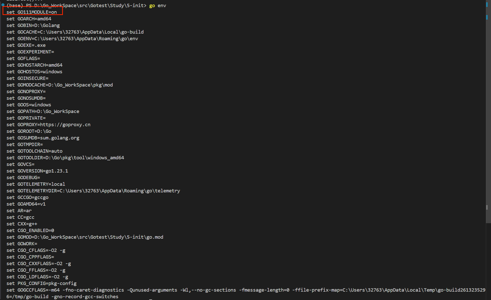
2. 在终端执行代码`go env -w GO111MODULE=on`之后再`go env`检查一下`GO111MODULE`的状态是否是on，如果是，恭喜你，go mod start！

### 使用go mod（养成好习惯！）
每当你想要新建一个项目时，一定要先使用go mod构建项目，这样go mod会自动帮你管理项目的依赖。
#### 具体流程
1. 新建文件夹——>在终端打开（记得一定要在这个文件夹的终端路径！）
2.  `go mod init 名称` 名称自己随便取，不要包含中文
3.确认go.mod文件是否生成
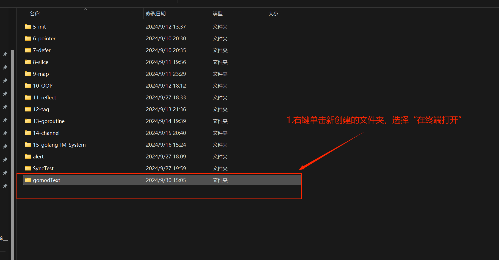
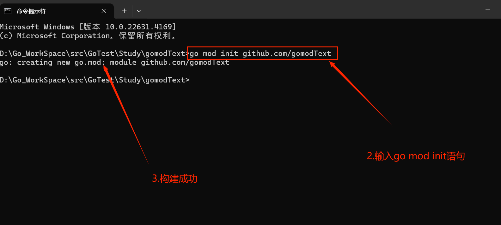
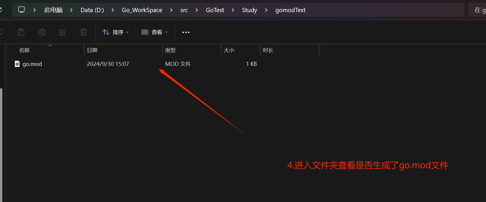

完成以上步骤后，最后再次恭喜你，你的golang学习之路已经平坦无阻！

---

接下来推荐一下我个人在用的学习资料。对于零基础的同学来说，不要看官方文档！或者说文档类的学习资料对于大多数零基础同学都不合适（当然，我这篇除外）。因此我更加推荐通过看网课视频来学习基础的语法知识。

零基础进：
[奇淼讲golang（力荐）](https://www.bilibili.com/video/BV1W7411N7iq/?spm_id_from=333.788&vd_source=ba555caf87e1e2f9c37b53d8c4b0e3e8)
[狂神说golang](https://www.bilibili.com/video/BV1ae41157o9/?spm_id_from=333.337.search-card.all.click&vd_source=ba555caf87e1e2f9c37b53d8c4b0e3e8)

有基础的来：
[八小时转职Golang](https://www.bilibili.com/video/BV1gf4y1r79E/?spm_id_from=333.1365.top_right_bar_window_default_collection.content.click)

头铁的进：
[Tour of Go(官方文档)](https://go.dev/tour/)
[Go语言圣经](https://golang-china.github.io/gopl-zh/index.html)

附
编译工具推荐：
 1. visual Studio Code，记得有Code，蓝色的那个，别下错了
 2. GoLand

