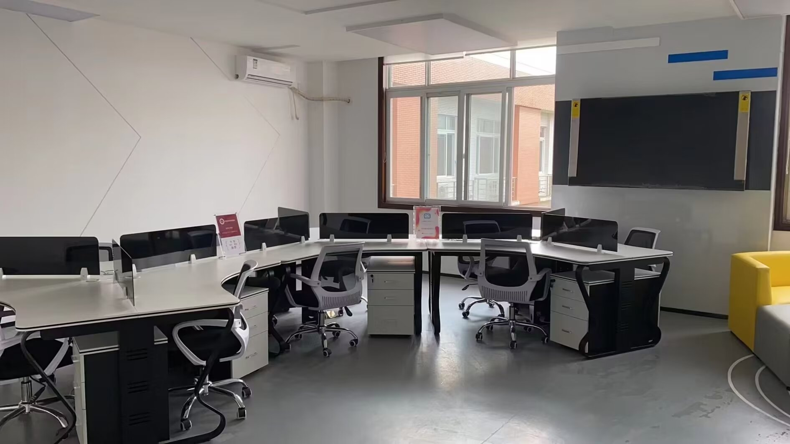
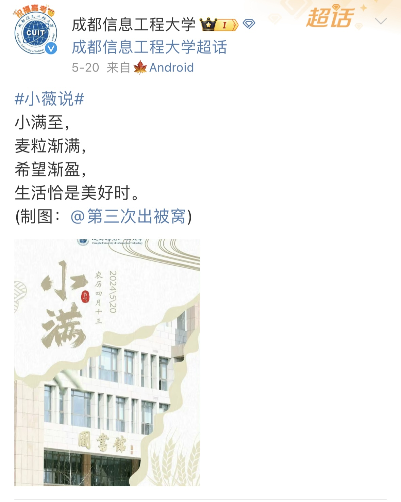
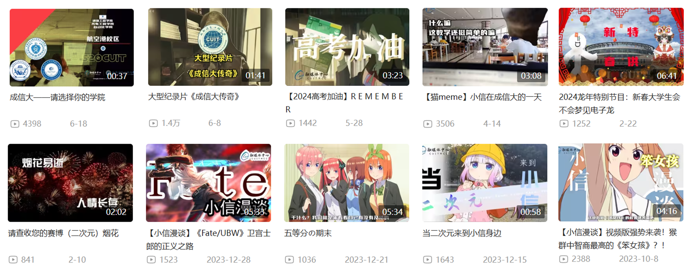

# 融媒体中心

## Part 1 你不知道的融媒体中心

1. **可以简单介绍一下融媒体中心吗？**

   成都信息工程大学学生融媒体中心由学校党委宣传部组织成立，由新媒体中心和校报记者团组成，下设运编部、影视部、设计部、秘书部四个学生部门。在这里，融媒 er 们用照片视频记录成信发展，用字句文案传达成信故事。

2. **融媒体的理念是什么呢？就是仅作为官方发布平台吗？**

   融媒体中心自创建以来，就秉持“参与，沟通，记录你的校园生活”的理念，我们不仅是发布学校相关信息的官方平台，更是记录杏仁们日常校园生活的平台，严肃而不失活泼。

3. **融媒er都好相处吗？我们能不能和ta们愉快相处呢？**

   当然好相处啦！融媒体中心汇聚的五湖四海的小伙伴们！有热爱文字的微信部，活泼可爱的VQ部，ACG氛围浓厚的B站部，专注于发挥创意的影视部，用图画讲述岁月的设计部，以及贴心温暖的秘书部！只要你来，就能发挥出自己的优势！

4. **加入融媒体会占用很多时间吗？**

   不会哟！我们每一个部门都是一个紧密合作小团队，绝不是你一个人在战斗。主编在分配任务时也会考虑大家的空闲时间情况，不会占用大家的学习时间和过多的休息时间。不过，有付出才会有收获，一定时间的投入是必不可少的，也需要杏仁们多方面考量，合理分配时间和精力。

5. **如果日后想要从事新媒体相关的工作，融媒体中心会对我有帮助吗？**

   答案是当然的啦！融媒体中心会不定期提供新媒体方面实习和工作机会！在学习新媒体技能的同时，也有机会参与各大新媒体平台的相关活动。融媒体中心的很多学长学姐都选择了在新媒体方面继续深造，不论是考研还是工作，都可以向他们取经！

6. **好专业的样子，你们平时是不是会参与不少大型活动啊**？

   没错！学校的各种大型活动现场都能看到我们融媒体中心的身影！开学典礼、毕业典礼、军训汇报表演......我们风雨无阻，时刻行走在校园资讯第一线！

7. **听起来很正式，融媒体的大家会很严肃嘛？**

   融媒体中心的小伙伴都是非常活泼友好的，大家以花名相称，没有严肃的团队角色压力。除了一起认真工作，也会一起学习、组队参加竞赛、干饭聊天，在学习和生活中互相帮助。融媒体中心的特色团建，空港龙泉双校区联动，打破校区次元壁不是梦！

8. **我们学校有专属卡通形象？速速给我看看！！**

   我们学校一共有三个卡通形象，分别是蓝色的小信和红色的小薇，以及代表我校特色专业的云宝。加入融媒体中心，你就可以成为小薇小信的代言人，更有机会穿上小薇小信人偶服，近距离接触其他杏仁噢！！

9. **融媒体一定大佬云集吧，小白还有机会加入吗？？**

   不用担心噢，我们每个部门会根据实际情况，邀请融媒体的学长学姐或校外知名媒体人开展相关的培训，来提高大家的新媒体专业能力。我们更看重你对新媒体的热爱，和工作的态度噢~

## Part 2 在融媒体中心，你可以……

* 加满德育分不是梦
* 得到川内各媒体平台内推实习机会，并且获得优秀的实习证明与岗位聘书
* get党委宣传部融媒体中心官方账号的运营经验（微博，微信，QQ，抖音，B站和今年刚刚运营的小红书，任你挑选）
* 在这里还可以参加省内知名高校和各大媒体社交平台交流会
* 不定期话剧，电影票和演唱会门票的内部赠送（下一个去见偶像的就是你）
* 更有各路大神带你学摄影，拍Vlog，教PrPs，包会的
* 当然，这份工作时间是弹性化的，不会耽误你的学习时间，工作氛围也是轻松愉快滴。（给你朋友一样的相处，家人一样的温暖）

## Part 3 融进去，才是家

* **拥有属于自己的办公室，等你来自习**

  

  

  

  

* **军训补给，新年台历，融媒体周边……各种专属福利，等你来解锁**

  

* **在生日和年节时，收获到专属于我们的祝福**

  

* **温馨年会与各种团建活动**

  

  

  

* **与伙伴们一起合个影**

  

  

## Part 4 请选择你的部门

### 影视部

1. **部门介绍**

   从策划到拍摄，从剪辑到后期，我们全程参与，打造高质量的校园影视作品。无论是日常生活还是学校的各大活动，都是我们展现才华的舞台。我们还负责学校抖音官方账号的运营，发布原创视频内容，提升学校及部门影响力。

2. **部门氛围**

   影视部是一个温馨和谐、充满乐趣的大家庭。在这里，你可以感受到团队的默契与协作，可以尽情发挥你的创意与才华。我们鼓励创新思维，尊重个性差异，相信每一个成员都是独一无二的宝藏。工作之余，我们还会组织丰富多彩的团建活动，增进彼此间的了解与友谊，让工作与生活更加丰富多彩。

3. **工作要求**
   * 对摄影摄像、影视后期有浓厚的兴趣与热爱
   * 有一定的摄影基础或后期基础
   * 有良好的审美趣味和较高的政治素养

4. **成果展示**

   

   

   

   

   点击链接，查看相关内容
   
   [成都信息工程大学的抖音 - 抖音 (douyin.com)](https://www.douyin.com/user/MS4wLjABAAAA3WbTr8uiHwuTeSkyJElbUm_ktbGNY9yx4mOcr7xxN-A?modal_id=7385073606201543970)

### 设计部

1. **部门介绍**

   我们致力于通过视觉传达信息和理念，用艺术的语言塑造校园形象。在设计部，我们不仅仅是设计师，更是创作者，我们用线条勾勒故事，用色彩碰撞升华，用心灵触摸世界，用双手创造未来。

2. **工作内容**

   * 向官媒提供优质图片：包括但不限于热点制图，校园吉祥物手绘，节日节气以及各种活动海报
   * 配合其他兄弟部门，保证各种工作开展，为融媒体中心保驾护航

3. **部门氛围**

   * 设计部的工作氛围以互帮互助为核心，团队成员间的关系如同家人般亲密，只要你对设计有热情，我们都欢迎你的加入
   * 我们鼓励自由交流思想，尊重每个人的创意和贡献，致力于打造一个开放、包容、创新的部门环境
   * 我们定期举行团建活动，增进彼此的了解与友谊，同时也通过内部培训不断提升团队的专业技能

4. **成果展示**

   

   

### 秘书部

1. **部门介绍**

   秘书部承担着上传下达、协调各方的重要职责。我们不仅是活动的幕后策划者，更是日常运作的守护者。在这里，你将学习到如何高效地管理信息、协调资源，以及如何与每一位小伙伴打好关系，共同维护中心的正常运作。

2. **工作内容**

   * 秘书部是融媒体中心的后勤与保障。活动、人员、设备、资金，我们尽在掌握。
   * 秘书部是融媒体中心各部门的润滑剂。沟通协调、上传下达、安排调度，我们全知全息。
   * 秘书部是融媒体中心在小红书的负责部门。新的业务新的挑战，我们整装待发。

3. **部门氛围**

   我们是秘书部这个充满温馨与包容的小家中的兄弟姐妹。我们工作轻松愉快，尊重大家的想法与贡献。严谨细致的工作态度、全军出击的团建活动，是秘书部独特的底色。

4. **成果展示**

   

   

### 运编部

#### 微信

1. **部门职责**

   * 微信运编部，是融媒体中心的部门之一，它负责成都信息工程大学微信公众号的运营，包括微信内容整理、选取、编辑、排版及推送。
   * 向校内和校外展现校园生活,传递校园声音,及时发布校园相关信息。
   * 分析微信运营数据，优化推文质量,提高运营效率。

2. **部门特色**

   * 为热爱文字的杏仁提供一个施展才华的平台
   * 用文字记录校园生活，留下自己的青春记忆
   * 用自己的方式，表达对校园和生活的热爱
   * 在实践中成长，能够学到许多公众号的相关知识，了解不同公众号的创作风格，扩宽视野

3. **部门要求**

   * 责任心强，认真严谨，积极开朗
   * 有兴趣和有意愿写出有价值和有温度的内容
   * 观察校园,爱对学校生活进行思考
   * 对热点具有敏感度

4. **成果展示**

   

   
   
   点击链接，查看相关内容
   
   [青春回忆录 —— 来拖动你的大学进度条吧！ (qq.com)](https://mp.weixin.qq.com/s/qhN5132yh4DXT7XEF_f1uQ)
   
   [学霸宿舍 ▏东方既白，未来已来！ (qq.com)](https://mp.weixin.qq.com/s/jUco6X_Hd5HeYXns-PVuKw)
   
   [30天，上高山！成信大约你来见! (qq.com)](https://mp.weixin.qq.com/s/GKe5A0EOQccKKf5aqeZWFQ)
   
   [摊牌了，成信大学子的一天这样度过…… (qq.com)](https://mp.weixin.qq.com/s/S98uyiuudQhHhRM-v2IKSA)

#### VQ

1. **部门介绍**

   你想成为小薇小信的“网红”运营官吗？

   你想和微博24w+的粉丝亲密接触吗？

   你想与其他高校交流互助吗？

   我们是CUIT官方微博和QQ的代言人，时刻处于5G冲浪第一线，分享热点话题，创造网络爆点；我们与杏仁亲密交流，与校内各大部门、社团对接，传递官方消息，传播成信之音；另外，我们还将与神秘嘉宾合作，为杏仁们带来各种惊喜和福利。

   快来加入VQ吧，成为小薇、小信的代言人！

   快来加入VQ吧，打开你的脑洞创造更多网络爆点！

   快来加入VQ吧，我们一起为所有的杏仁们带来更多惊喜！

2. **优秀作品**

   

   

   
   
   点击链接，查看相关内容
   
   [@成都信息工程大学 的个人主页 - 微博 (weibo.com)](https://weibo.com/u/5344577412)

#### B站

1. **部门介绍**

   * B站运编部，是融媒体中心的部门之一，它负责成都信息工程大学B站平台官方账号的日常运营、动态编辑、私信回复、信息传递以及视频产出。
   * 遵循“成于大气，信达天下”的学校校训，以“讲好成信故事，传递成信声音”为己任，向社会展现本校风采、增强本校学子归属感。

2. **部门氛围**

   * 部门氛围和谐，聊天群十分活跃，团建遥遥领先，进来绝不会寂寞！
   * 部门成员皆是B站Lv6的牢用户，上知蓝蓝路，下知看见情侣的火车头。B站热点，无所不知
   * 部门二刺螈，ACG氛围浓厚
   * 部门归属感强，六代同堂

3. **部门要求**

   * 对B站文化圈有一定了解
   * 对ACG亚文化圈有一定涉及
   * 掌握一定的编辑文案能力
   * 热爱新闻传媒工作，拥有较高政治素养，新闻觉悟，理解并支持官号立场
   * 有数字媒体制作经历或对这方面感兴趣，要求了解数字媒体编辑相关软件的使用（如：Adobe、剪映、可画等）

4. **成果展示**

   融媒体中心B站部每天保持动态的更新，并且周期性地更新趣味视频，以幽默风趣的表达方向拉近与同学的距离。每每B站推出高校宣传类活的活动，我们总是冲在高校中的最前列，意在让同学们更了解我们学校的特色。也正是有了我们的积极参与，才让我们在B站开屏广告处得以出现。

   

   

   

   

   点击链接，查看相关内容

   [成都信息工程大学的个人空间-成都信息工程大学个人主页-哔哩哔哩视频 (bilibili.com)](https://space.bilibili.com/235570889?plat_id=1&share_from=space&share_medium=android&share_plat=android&share_session_id=18080cac-b889-4b80-a8e3-1f04981d0e8a&share_source=COPY&share_tag=s_i&timestamp=1721294686&unique_k=2zu2gFA)

## Part 5 融媒体中心，“媒”你不行

相遇融媒，只为热爱你的热爱。
捕捉校园，只为创造你的风采。
创意无限，只为展现你的才华。

欢迎加入2024融媒体中心暑期训练营群，群号：495925109

欢迎加入2024CUIT融媒体中心招新群，群号：942842851

