# 生活权益部

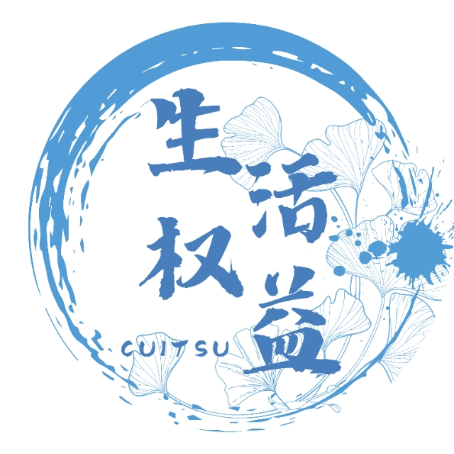

成都信息工程大学学生会生活权益部，是搭建在成信学子与学校管理、后勤保障部门双向沟通的职能部门。部门下设三个工作组，各司其职开展日常工作，承载学风督导、第二课堂管理、校园权益服务三大职能。生活权益部下设三大部门：

## 督导组

1.线上核对各个学院的考勤结果。严谨核对各项考勤数据，以温和引导的方式规范校园日常秩序。
2.巡查校园文明修身情况。
3.例会三分钟。

<dev>
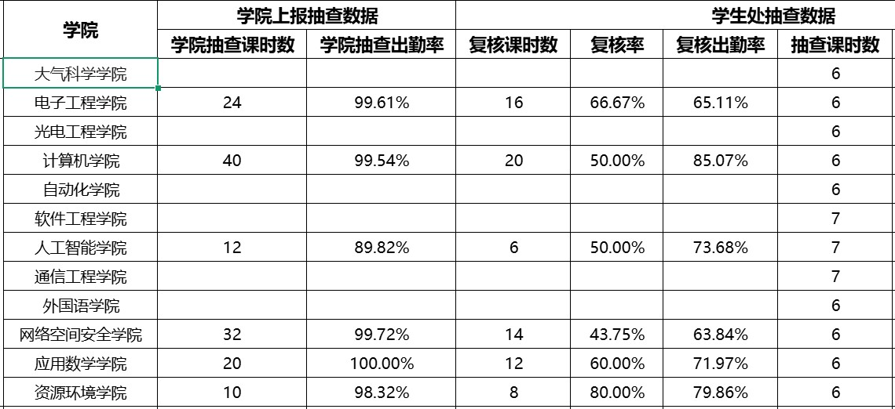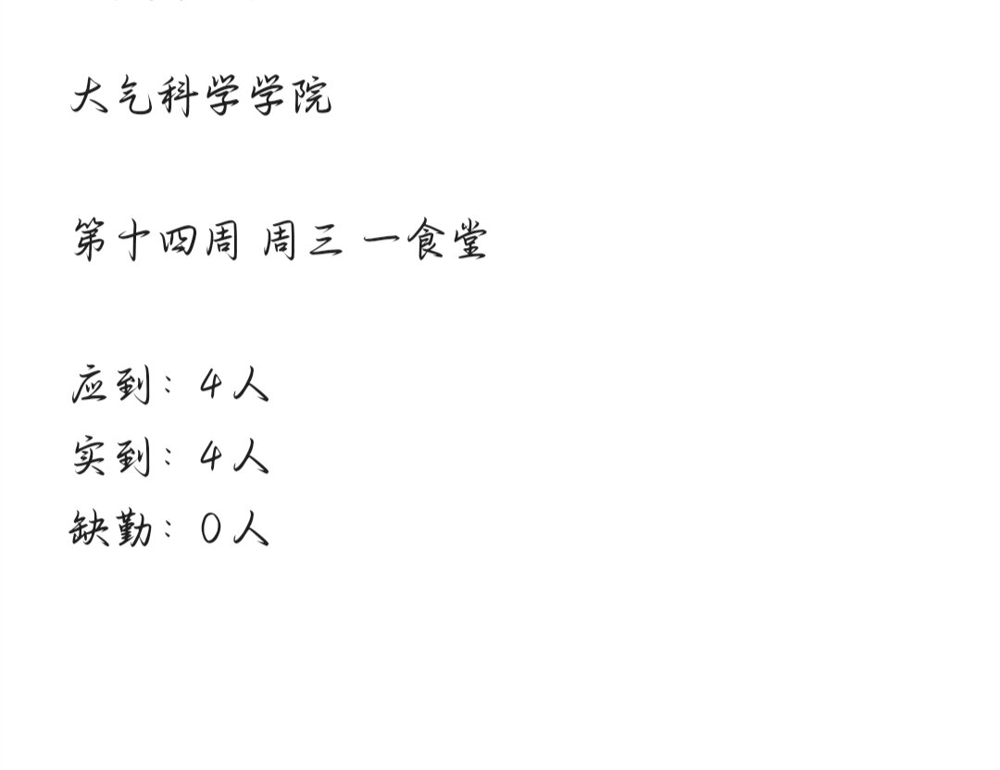
</dev>

 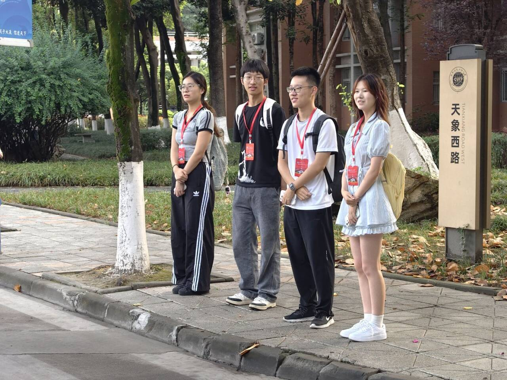

## 二课组

1.统筹校学生会各部门各类学生活动的第二课堂全流程管理，负责线上活动申报、完结归档。
2.统一制作活动排布时间表，统计部门成员在校空余时间，统计成员对信息的回复情况。

<dev>
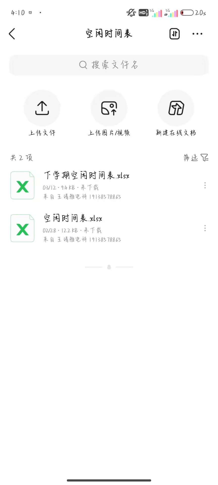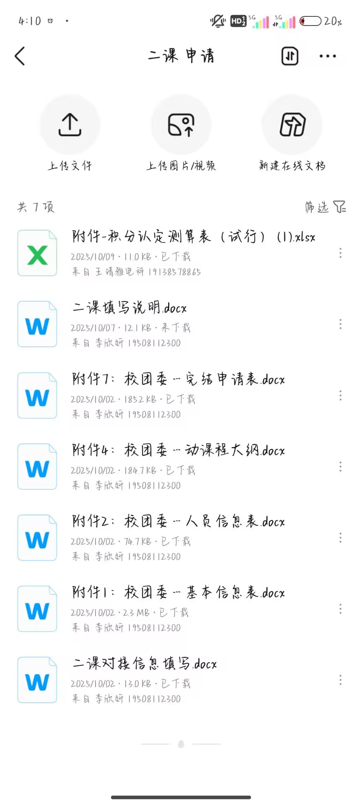
</dev>

## 维权组

1.主动对接学校后勤部门沟通协调，并跟进问题整改进度。
2.部门每次例会均做好文字记录与影像留存。
3.对校学生会举办的志愿活动进行志愿四川的申请与志愿四川人员的统计与提交。

<dev>
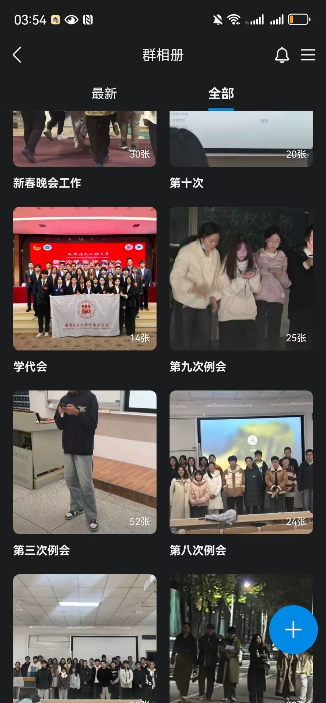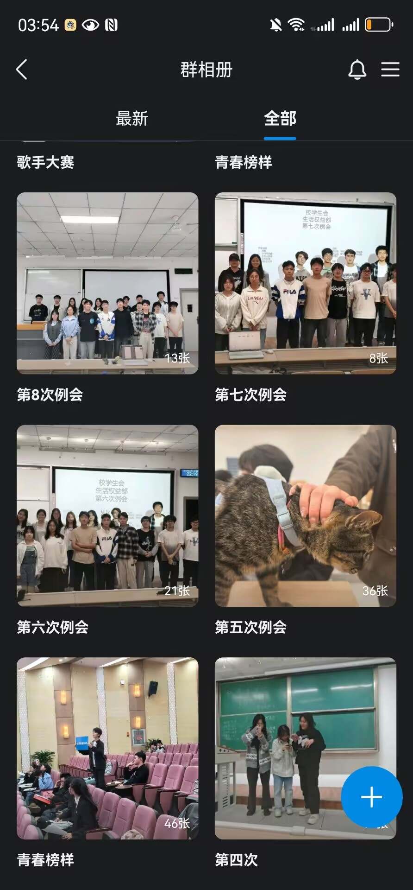
</dev>

## 部门风貌

部门工作条理清晰、分工明确。负责人进行带教指导，新手可以快速上手办公流程。课余时间组织聚餐团建，团队氛围融洽和睦。以服务同学为初心，以踏实做事为准则，生活权益部期待热忱真诚的新同学加入，一同守护美好的校园生活。

<dev>
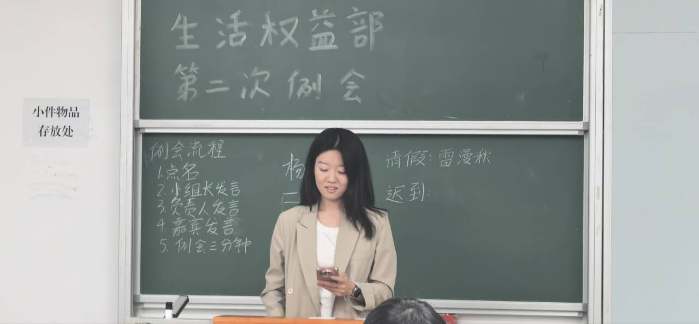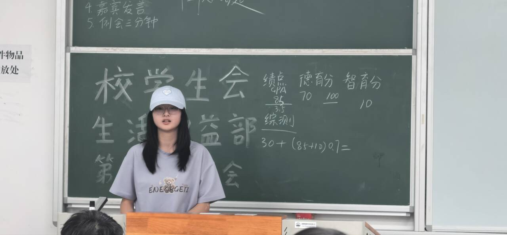
</dev>

图：部门成员例会发言、分享经验

## 成长收获

1. 能力提升：熟练掌握Office办公操作，在沟通协调事务中锻炼逻辑思维与表达能力，处理事情更加条理稳重。
2. 实践履历：拥有校级学生组织工作经历，可获取德育加分、第二课堂分数积累和志愿时长的增长，助力综测评优。
3. 真挚友谊：部门氛围和睦融洽，在协作工作与团建活动中，结识一群志同道合的伙伴。
4. 思想成长：学长学姐分享大学经验，涵盖入团入党、班干部工作、奖学金以及保研等等。

<dev>
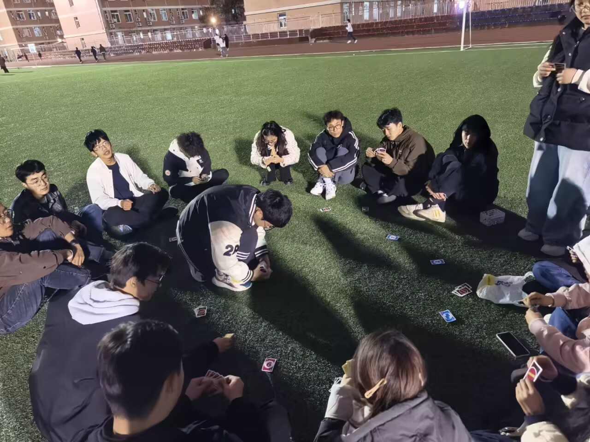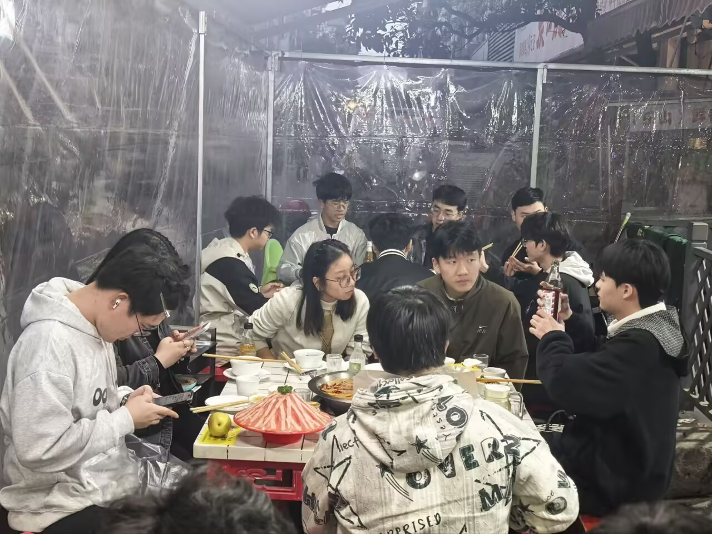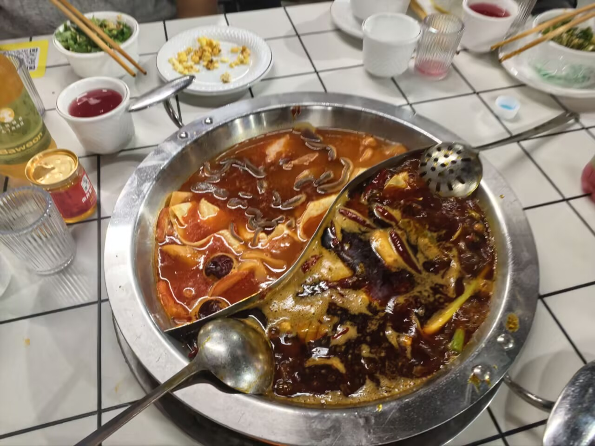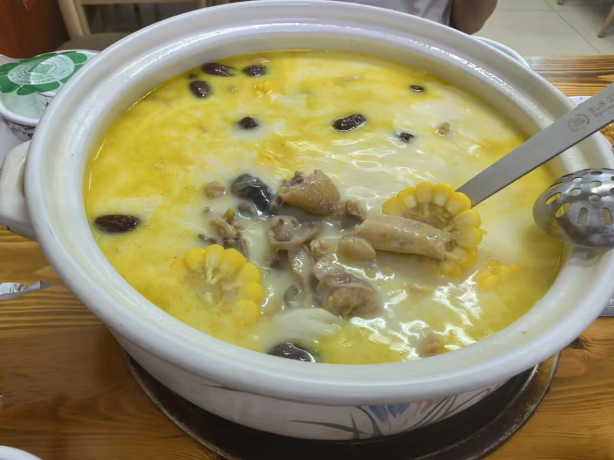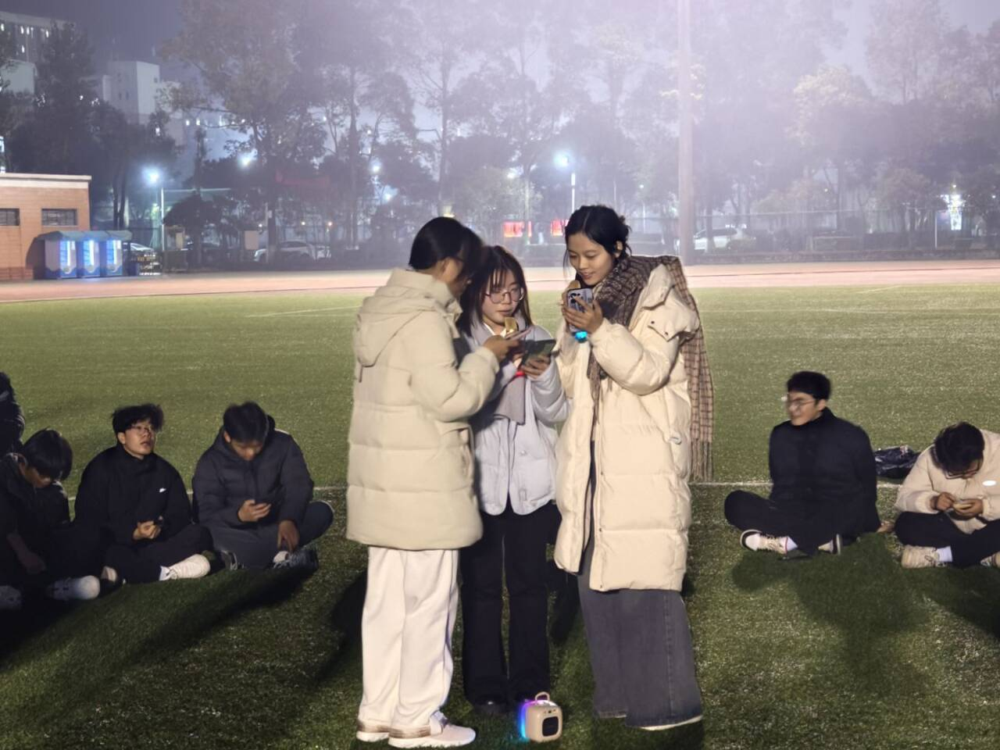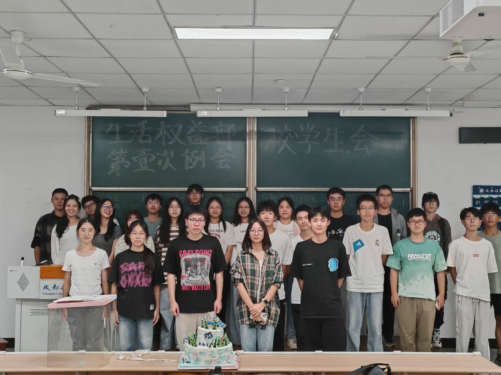
</dev>

图：部门团建及例会

##  加入方式

欢迎加入成都信息工程大学学生会生活权益部！扫描下方二维码加入我们的招新群吧！我们期待你的到来：

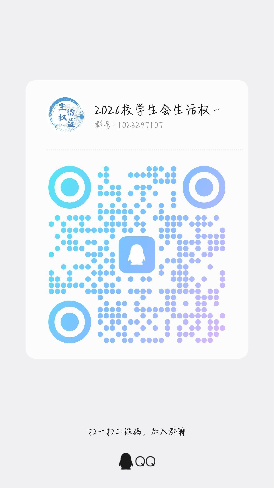
